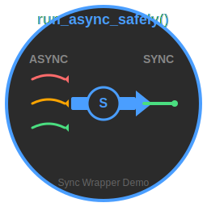

# 🎨 Sync Wrapper Demo - Icon Guide

Complete icon package for the `run_async_safely()` demo application.

## 📦 Icon Formats Created

| Format | File | Size | Use Case |
|--------|------|------|----------|
| **SVG** | `sync_wrapper_icon.svg` | 2.2 KB | Scalable, web, documentation |
| **PNG** | `sync_wrapper_icon.png` | 6.1 KB | Desktop apps, standard icon |
| **PNG** | `sync_wrapper_icon_128.png` | 12 KB | Large desktop icon |
| **PNG** | `sync_wrapper_icon_64.png` | 5.2 KB | Medium desktop icon |
| **PNG** | `sync_wrapper_icon_48.png` | 3.6 KB | Standard desktop icon |
| **PNG** | `sync_wrapper_icon_32.png` | 2.0 KB | Small desktop icon |
| **PNG** | `sync_wrapper_icon_16.png` | 725 B | Tiny icon, favicon |
| **ICO** | `sync_wrapper_icon.ico` | 29 KB | Windows executable |
| **XPM** | `sync_wrapper_icon.xpm` | 2.7 KB | Linux X11 desktop |
| **TXT** | `sync_wrapper_icon.txt` | 1.2 KB | ASCII art for terminal |

## 🖼️ Icon Preview (ASCII)

```
    ╔═══════════════════════════════════════╗
    ║      🔄 SYNC WRAPPER DEMO 🔄          ║
    ╠═══════════════════════════════════════╣
    ║                                       ║
    ║    ASYNC ~~~~> [S] =====> SYNC       ║
    ║                                       ║
    ║    async def      run_async_safely()  ║
    ║    ↓              ↓                   ║
    ║    coroutine  →  result               ║
    ║                                       ║
    ║    Complex    →  Simple               ║
    ║    await      →  No await             ║
    ║    asyncio    →  Just works           ║
    ║                                       ║
    ╠═══════════════════════════════════════╣
    ║    Click to launch interactive demo  ║
    ╚═══════════════════════════════════════╝
```

## 🚀 Quick Install

### Desktop Icon (Linux)

```bash
# Run installer script
./install_icon.sh

# Or manually:
cp sync-wrapper-demo.desktop ~/Desktop/
chmod +x ~/Desktop/sync-wrapper-demo.desktop
```

### Windows Shortcut

1. Navigate to: `\\wsl$\Ubuntu\home\jevenson\.claude\lib\`
2. Right-click on `launch_demo_with_icon.bat`
3. Select "Create shortcut"
4. Move shortcut to Desktop
5. Right-click shortcut → Properties → Change Icon
6. Browse to `sync_wrapper_icon.ico`

### Applications Menu (Linux)

```bash
# Install to apps menu
cp sync-wrapper-demo.desktop ~/.local/share/applications/

# Copy icon to standard location
mkdir -p ~/.local/share/icons
cp sync_wrapper_icon.png ~/.local/share/icons/
```

## 🎯 Icon Design

The icon visually represents the transformation from async to sync:

- **Left side (ASYNC)**: Wavy lines representing async operations
  - Red wave: First async task
  - Orange wave: Second async task
  - Green wave: Third async task

- **Center (Wrapper)**: Blue circle with 'S' representing the sync wrapper
  - Arrow shows transformation direction
  - Circle represents encapsulation

- **Right side (SYNC)**: Straight line representing synchronous execution
  - Green color indicates success
  - Simple, linear flow

- **Colors**:
  - Background: `#2B2B2B` (dark theme)
  - Primary: `#4A9EFF` (blue)
  - Success: `#4ADE80` (green)
  - Warning: `#FFA500` (orange)
  - Error: `#FF6B6B` (red)

## 📱 Usage Examples

### In Python GUI (tkinter)

```python
import tkinter as tk
from PIL import Image, ImageTk

root = tk.Tk()
icon = ImageTk.PhotoImage(Image.open("sync_wrapper_icon.png"))
root.iconphoto(False, icon)
```

### In Desktop File

```ini
[Desktop Entry]
Icon=/home/jevenson/.claude/lib/sync_wrapper_icon
# Note: No extension needed, system will find best format
```

### In HTML/Web

```html
<link rel="icon" href="sync_wrapper_icon.svg" type="image/svg+xml">
<!-- Or PNG for compatibility -->
<link rel="icon" href="sync_wrapper_icon_32.png" sizes="32x32">
<link rel="icon" href="sync_wrapper_icon_16.png" sizes="16x16">
```

### In Markdown

```markdown

```

### In Terminal

```bash
# Display ASCII icon
cat sync_wrapper_icon.txt

# Use in scripts
echo "$(cat sync_wrapper_icon.txt)"
echo "Launching demo..."
```

## 🛠️ Regenerate Icons

If you need to regenerate or modify icons:

```bash
# Run icon generator
python3 generate_icon.py

# This will create all formats automatically
```

## 📋 Files Included

```
/home/jevenson/.claude/lib/
├── sync_wrapper_icon.svg         # Vector (scalable)
├── sync_wrapper_icon.png         # Main PNG (256x256)
├── sync_wrapper_icon_*.png       # Multiple sizes
├── sync_wrapper_icon.ico         # Windows icon
├── sync_wrapper_icon.xpm         # X11 pixmap
├── sync_wrapper_icon.txt         # ASCII art
├── generate_icon.py              # Icon generator script
├── install_icon.sh               # Installation script
├── sync-wrapper-demo.desktop     # Desktop entry
├── launch_demo_with_icon.bat     # Windows launcher
└── ICON_GUIDE.md                # This file
```

## ✨ Features

- **Multi-format**: 10+ formats for all platforms
- **Scalable**: SVG for any size
- **Cross-platform**: Windows, Linux, macOS
- **Terminal-friendly**: ASCII art version
- **Professional**: Consistent color scheme
- **Semantic**: Visual represents async→sync transformation
- **Complete**: All standard sizes included

## 🎨 Customization

To customize colors or design:

1. Edit `generate_icon.py`
2. Modify color values or shapes
3. Run `python3 generate_icon.py`
4. Icons regenerated automatically

## 📝 License

Icons are part of the Sync Wrapper Demo project and follow the same license as the main codebase.

---

**Created:** November 7, 2025
**Icon Version:** 1.0
**Location:** `/home/jevenson/.claude/lib/`