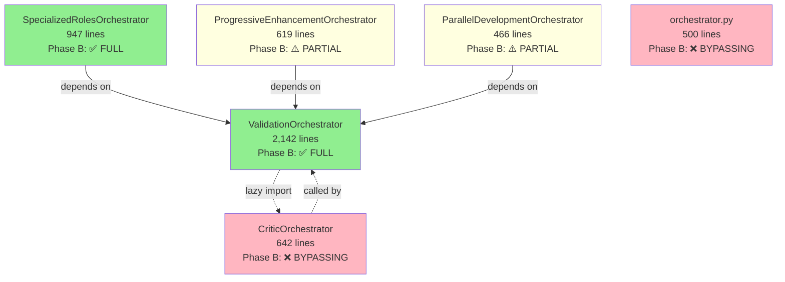

# Phase 2 Consolidation - Documentation Master Plan

**Project:** ZeroTouch Atlas (ZTE Orchestrator System)
**Planning Date:** 2025-11-09
**Documentation Expert:** Claude Code (Sonnet 4.5)
**Context:** Phase 2 consolidation following comprehensive audit (AUDIT_REPORT.md)
**Status:** Planning Phase - Awaiting Execution Approval

---

## Executive Summary

This plan details all documentation needed to support Phase 2 consolidation of the ZTE orchestrator system. Based on audit findings showing 2,142-line god class, circular dependencies, and incomplete Phase B migration, comprehensive documentation is critical to ensure smooth adoption of the new architecture.

**Key Documentation Deliverables:**
- 15 new documents
- 8 updated documents
- 12 code examples
- 6 architecture diagrams
- 3 migration guides
- 5 ADRs (Architecture Decision Records)

**Timeline:** 4-5 weeks parallel with code changes
**Review Process:** 2-phase review (technical accuracy + user comprehension)

---

## Table of Contents

1. [Architecture Documentation](#1-architecture-documentation)
2. [API Documentation](#2-api-documentation)
3. [Code Documentation](#3-code-documentation)
4. [Developer Documentation](#4-developer-documentation)
5. [Migration Documentation](#5-migration-documentation)
6. [Decision Records (ADRs)](#6-decision-records-adrs)
7. [Testing Documentation](#7-testing-documentation)
8. [Diagrams & Visualizations](#8-diagrams--visualizations)
9. [Timeline & Dependencies](#9-timeline--dependencies)
10. [Review Process](#10-review-process)
11. [Success Criteria](#11-success-criteria)

---

## 1. Architecture Documentation

### 1.1 Current Architecture (Before Consolidation)

**Document:** `docs/architecture/CURRENT_ARCHITECTURE.md`

**Status:** 📝 NEW - Must create before code changes

**Purpose:** Preserve understanding of current system before refactoring

**Content Outline:**

```markdown
# Current Architecture (Pre-Phase 2)

## System Overview
- 6 orchestrator files (5,316 lines)
- Central hub: ValidationOrchestrator (2,142 lines, 39%)
- Phase B compliance: 33% full, 33% partial, 33% bypassing

## Component Diagram
[Diagram showing all 6 orchestrators and dependencies]

## Dependency Graph
- ValidationOrchestrator ← 3 orchestrators (hub pattern)
- Circular dependency: validation ↔ critic
- BaseAgent (old) vs. ResilientBaseAgent (Phase B)

## Responsibility Matrix
| Orchestrator | Primary Role | Lines | Phase B | Issues |
|--------------|--------------|-------|---------|--------|
| validation_orchestrator | Validator coordination | 2,142 | ✅ FULL | God class, 4 responsibilities |
| [... 5 more orchestrators] |

## Known Issues
- God class (validation_orchestrator: 2,142 lines)
- Circular dependency (validation ↔ critic)
- Phase B bypass (critic, orchestrator.py)
- Duplicate logic (model selection in 3 files)
- Over-dependency (3 files depend on ValidationOrchestrator)

## Current Phase B Integration
- ResilientBaseAgent: 2/6 files
- SessionManager: 1/6 files
- CircuitBreaker: Inherited only
- CostTracker: Custom implementations instead of Phase B

## File Statistics
[Table with lines, responsibilities, dependencies]
```

**Code Examples:** None (architectural overview)

**Diagrams Needed:**
1. Current dependency graph (showing circular dependency)
2. Current component diagram (all 6 orchestrators)
3. Current Phase B integration status (color-coded)

**Timeline:** Week 0 (before code changes begin)
**Estimated Effort:** 4-6 hours
**Owner:** Documentation Expert + System Architect

---

### 1.2 Target Architecture (After Consolidation)

**Document:** `docs/architecture/TARGET_ARCHITECTURE.md`

**Status:** 📝 NEW - Create during planning phase

**Purpose:** Define future state to guide development

**Content Outline:**

```markdown
# Target Architecture (Post-Phase 2)

## System Overview
- Reduced from 6 → 8 files (decomposition + utilities)
- 35% code reduction (~1,800 lines saved)
- 100% Phase B compliance
- Zero circular dependencies
- Modular, reusable utilities

## Component Diagram
[Diagram showing new structure with validation decomposed]

## New Structure
validation_orchestrator.py (~600 lines) ← CORE
├── Focus: Orchestrate validators only
├── Clean, single responsibility
└── Uses injected utilities

validation_critic_integration.py (~400 lines) ← NEW
├── Focus: Integrate critics with validators
├── Breaks circular dependency
└── Uses both ValidationOrchestrator + CriticOrchestrator

validation_filesystem.py (~250 lines) ← NEW
├── Focus: File system operations
├── Pure utility (no LLM calls)
└── Reusable across orchestrators

validation_reporter.py (~150 lines) ← NEW
├── Focus: Report generation
├── Standardized reporting interface
└── Reusable across orchestrators

model_selector.py (~150 lines) ← NEW
├── Focus: Centralized model selection
├── Single source of truth
└── Used by 3+ orchestrators

[... 3 more orchestrators updated to Phase B]

## Dependency Graph
[Clean, no circular dependencies]
- Utilities injected via dependency injection
- Validation optional/pluggable
- Clear dependency direction

## Phase B Integration
- ResilientBaseAgent: 100% (all orchestrators)
- SessionManager: Where needed
- CircuitBreaker: Automatic via inheritance
- CostTracker: Centralized (no custom implementations)

## Benefits
✅ Single Responsibility Principle
✅ No circular dependencies
✅ Reusable utilities
✅ Easy to test (dependency injection)
✅ 100% Phase B compliance
✅ 35% code reduction
```

**Code Examples:**
1. Example: Creating ValidationOrchestrator with injected utilities
2. Example: Using ModelSelector across orchestrators
3. Example: ValidationCriticIntegrator breaking circular dependency

**Diagrams Needed:**
1. Target dependency graph (clean, no cycles)
2. Target component diagram (8 files, clear boundaries)
3. Target Phase B integration (100% green)
4. Before/after comparison diagram

**Timeline:** Week 0-1 (planning + early implementation)
**Estimated Effort:** 6-8 hours
**Owner:** Documentation Expert + System Architect

---

### 1.3 Migration Path (Transition Guide)

**Document:** `docs/architecture/MIGRATION_PATH.md`

**Status:** 📝 NEW - Create during planning phase

**Purpose:** Step-by-step roadmap from current → target architecture

**Content Outline:**

```markdown
# Migration Path: Current → Target Architecture

## Overview
4-phase migration over 4-5 weeks with incremental rollout and testing.

## Phase Breakdown

### Phase 1: Critical Fixes (Week 1-2)
**Focus:** Break up god class, fix circular dependency, Phase B migration

**Changes:**
1. CRITICAL-1: Decompose validation_orchestrator (12-16 hrs)
   - Extract reporter → validation_reporter.py (~150 lines)
   - Extract filesystem → validation_filesystem.py (~250 lines)
   - Extract critic integration → validation_critic_integration.py (~400 lines)
   - Clean up core → validation_orchestrator.py (~600 lines)

2. CRITICAL-2: Migrate critic_orchestrator to Phase B (3-4 hrs)
   - Replace BaseAgent → ResilientBaseAgent
   - Add multi-provider fallback (Opus → GPT-4)
   - Inherit circuit breaker, retry, session management

3. CRITICAL-3: Fix circular dependency (included in CRITICAL-1)
   - Break import cycle via extraction
   - Use dependency injection

**Risks:** 🟡 MEDIUM (well-defined boundaries, extensive testing needed)

**Success Criteria:**
- [ ] 4 files created with clear responsibilities
- [ ] validation_orchestrator.py < 700 lines
- [ ] No circular dependencies
- [ ] All tests passing

### Phase 2: High Priority (Week 3)
**Focus:** Centralize utilities, fix bugs

**Changes:**
1. HIGH-1: Centralize model selection (4-6 hrs)
   - Create model_selector.py
   - Migrate 3 orchestrators to use it
   - Eliminate ~150 lines of duplicate code

2. HIGH-2: Centralize cost tracking (3-4 hrs)
   - Remove custom _estimate_cost() methods
   - Use Phase B's CostTracker everywhere
   - Eliminate ~100 lines of duplicate code

3. HIGH-3: Fix model config bug (0.5 hrs)
   - Fix Tier 1 to use Haiku (not Sonnet)

4. HIGH-4: Reduce ValidationOrchestrator coupling (6-8 hrs)
   - Create ValidationProvider protocol
   - Use dependency injection in 3 orchestrators

**Risks:** 🟢 LOW (utilities, clear interfaces)

**Success Criteria:**
- [ ] ModelSelector used by 3+ orchestrators
- [ ] Custom cost tracking removed
- [ ] Haiku bug fixed
- [ ] Loose coupling via protocols

### Phase 3: Medium Priority (Week 4)
**Focus:** Cleanup old infrastructure

**Changes:**
1. MEDIUM-1: Update or deprecate orchestrator.py (1-4 hrs)
2. MEDIUM-2: Clarify progressive_enhancement Phase B (2-3 hrs)
3. MEDIUM-4: Add observability to orchestrator.py (2-3 hrs)

**Risks:** 🟢 LOW

### Phase 4: Low Priority (Week 5)
**Focus:** Polish and optimization

**Changes:**
1. LOW-1: Evaluate parallel_development wrapper (2-3 hrs)
2. Documentation polish

**Risks:** 🟢 LOW

## Rollback Strategy
Each phase is independent. If issues arise:
1. Revert feature branch
2. Restore from backup
3. Incremental rollout allows partial adoption

## Testing Strategy
- After each extraction: Run full validation test suite
- After each migration: Verify no regression in quality
- Integration tests: Ensure end-to-end workflows still work
```

**Code Examples:** None (migration overview)

**Diagrams Needed:**
1. Phase timeline (Gantt chart style)
2. Dependency tree (showing extraction order)
3. Risk heatmap (color-coded by phase)

**Timeline:** Week 0 (before code changes)
**Estimated Effort:** 4-5 hours
**Owner:** Documentation Expert + Project Manager

---

## 2. API Documentation

### 2.1 Breaking Changes Log

**Document:** `docs/api/BREAKING_CHANGES.md`

**Status:** 📝 NEW - Update as changes occur

**Purpose:** Track all breaking API changes for downstream consumers

**Content Outline:**

```markdown
# Breaking Changes - Phase 2 Consolidation

## Overview
This document tracks all breaking changes introduced during Phase 2 consolidation.

**Recommendation:** Review this document before upgrading.

---

## Phase 1 Changes

### BREAKING: ValidationOrchestrator Decomposition

**Date:** 2025-11-XX
**Severity:** 🚨 HIGH
**Affected Users:** Anyone directly importing validation filesystem or reporting methods

**What Changed:**
- Methods moved from `ValidationOrchestrator` to new utility classes
- File system operations → `validation_filesystem.py`
- Reporting → `validation_reporter.py`
- Critic integration → `validation_critic_integration.py`

**Migration:**

BEFORE (Old API):
```python
from validation_orchestrator import ValidationOrchestrator

orchestrator = ValidationOrchestrator()
orchestrator._validate_directory("src/")  # ❌ REMOVED
orchestrator._generate_markdown_report(report)  # ❌ REMOVED
```

AFTER (New API):
```python
from validation_orchestrator import ValidationOrchestrator
from validation_filesystem import ValidationFilesystem
from validation_reporter import ValidationReporter

orchestrator = ValidationOrchestrator()
filesystem = ValidationFilesystem()
reporter = ValidationReporter()

filesystem.validate_directory("src/")  # ✅ NEW
reporter.format_markdown(report)  # ✅ NEW
```

**Compatibility Layer:**
Deprecated methods available in v1.0.x with warnings.
Removed in v2.0.0 (planned: 2025-12-XX).

**Timeline:**
- Phase 1 (Week 1-2): New APIs introduced
- Week 3-4: Deprecation warnings added
- Week 8: Old APIs removed

---

### BREAKING: CriticOrchestrator Multi-Provider Fallback

**Date:** 2025-11-XX
**Severity:** 🟡 MEDIUM
**Affected Users:** Anyone relying on Opus-only behavior

**What Changed:**
- Critics now support fallback: Opus → GPT-4 (if Opus unavailable)
- Previously: Hard failure if Opus unavailable

**Migration:**
No code changes required. Behavior change only:
- OLD: Opus failure → Exception
- NEW: Opus failure → Automatic GPT-4 fallback

**Opt-Out:**
```python
critic = CriticOrchestrator(allow_fallback=False)  # Opus-only (old behavior)
```

---

## Phase 2 Changes

### BREAKING: Model Selection Centralized

**Date:** 2025-11-XX
**Severity:** 🟢 LOW
**Affected Users:** Anyone using private `_select_model()` methods

**What Changed:**
- Model selection logic moved to `ModelSelector` utility
- Private methods removed from 3 orchestrators

**Migration:**

BEFORE:
```python
from specialized_roles_orchestrator import SpecializedRolesOrchestrator

orch = SpecializedRolesOrchestrator()
model = orch._escalate_model(current_model)  # ❌ REMOVED (was private)
```

AFTER:
```python
from model_selector import ModelSelector

model = ModelSelector.escalate(current_model)  # ✅ NEW
```

**Note:** These were private methods (prefixed with `_`), so minimal impact expected.

---

## Non-Breaking Changes (Enhancements)

### ENHANCEMENT: ValidationProvider Protocol

**Date:** 2025-11-XX
**Severity:** 🟢 LOW
**Affected Users:** Advanced users using dependency injection

**What Changed:**
- New `ValidationProvider` protocol for loose coupling
- Orchestrators accept validation via dependency injection

**Example:**
```python
from validation_protocol import ValidationProvider
from specialized_roles_orchestrator import SpecializedRolesOrchestrator

# Custom validator implementing protocol
custom_validator = MyCustomValidator()

# Inject into orchestrator
orch = SpecializedRolesOrchestrator(validator=custom_validator)
```

**Backward Compatible:** Yes (default: ValidationOrchestrator)
```

**Code Examples:** Embedded (before/after migration snippets)

**Timeline:** Week 0 (create), Updated weekly as changes occur
**Estimated Effort:** 2 hours (initial) + 1 hour/week (updates)
**Owner:** Documentation Expert

---

### 2.2 New Utilities API Reference

**Document:** `docs/api/UTILITIES_API.md`

**Status:** 📝 NEW - Create as utilities are built

**Purpose:** Document new utility modules (ModelSelector, ValidationFilesystem, etc.)

**Content Outline:**

```markdown
# Utilities API Reference

## Overview
Phase 2 consolidation introduced reusable utility modules to eliminate code duplication and improve maintainability.

---

## ModelSelector

**Module:** `model_selector.py`
**Purpose:** Centralized model selection and escalation logic

**Classes:**

### `ModelSelector`

Utility class for model selection across orchestrators.

**Constants:**

```python
TIERS = {
    "fast": "claude-3-5-haiku-20241022",
    "balanced": "claude-3-5-sonnet-20241022",
    "thorough": "claude-opus-4-20250514",
    "fallback": "gpt-4"
}
```

**Methods:**

#### `select_by_level(level: str) -> str`

Select model by validation level (quick/standard/thorough).

**Parameters:**
- `level` (str): Validation level ("quick", "standard", "thorough")

**Returns:** Model ID string

**Example:**
```python
from model_selector import ModelSelector

model = ModelSelector.select_by_level("standard")
# Returns: "claude-3-5-sonnet-20241022"
```

#### `select_by_quality(quality_score: float) -> str`

Select model by quality score (0.0-1.0).

**Parameters:**
- `quality_score` (float): Quality score between 0.0 and 1.0

**Returns:** Model ID string

**Logic:**
- quality < 0.7 → "thorough" (Opus)
- quality < 0.85 → "balanced" (Sonnet)
- quality >= 0.85 → "fast" (Haiku)

**Example:**
```python
model = ModelSelector.select_by_quality(0.65)
# Returns: "claude-opus-4-20250514"
```

#### `escalate(current_model: str) -> str`

Escalate to next higher tier.

**Parameters:**
- `current_model` (str): Current model ID

**Returns:** Next tier model ID

**Example:**
```python
next_model = ModelSelector.escalate("claude-3-5-haiku-20241022")
# Returns: "claude-3-5-sonnet-20241022"
```

**Used By:**
- `specialized_roles_orchestrator.py` (quality-based escalation)
- `progressive_enhancement_orchestrator.py` (tier system)
- `validation_orchestrator.py` (level-based selection)

---

## ValidationFilesystem

**Module:** `validation_filesystem.py`
**Purpose:** File system operations for validation workflows

**Classes:**

### `ValidationFilesystem`

Utility for file system operations (detection, traversal, validation).

**Methods:**

#### `validate_file(filepath: str) -> ValidationResult`

Validate single file.

**Parameters:**
- `filepath` (str): Path to file

**Returns:** `ValidationResult` object

**Example:**
```python
from validation_filesystem import ValidationFilesystem

fs = ValidationFilesystem()
result = fs.validate_file("src/auth.py")
```

#### `validate_directory(dirpath: str, recursive: bool = True) -> List[ValidationResult]`

Validate directory (optionally recursive).

**Parameters:**
- `dirpath` (str): Directory path
- `recursive` (bool): Traverse subdirectories (default: True)

**Returns:** List of `ValidationResult` objects

**Example:**
```python
results = fs.validate_directory("src/", recursive=True)
```

#### `detect_validators_for_file(filepath: str) -> List[str]`

Auto-detect required validators for file type.

**Parameters:**
- `filepath` (str): File path

**Returns:** List of validator names

**Example:**
```python
validators = fs.detect_validators_for_file("src/auth.py")
# Returns: ["code-validator", "security-validator"]
```

#### `detect_language(filepath: str) -> str`

Detect programming language from file extension.

**Parameters:**
- `filepath` (str): File path

**Returns:** Language name (e.g., "python", "javascript")

**Example:**
```python
lang = fs.detect_language("app.js")
# Returns: "javascript"
```

---

## ValidationReporter

**Module:** `validation_reporter.py`
**Purpose:** Standardized reporting for validation results

**Classes:**

### `ValidationReporter`

Generate reports from validation results.

**Methods:**

#### `generate_report(results: List[ValidationResult]) -> ValidationReport`

Generate structured report from validation results.

**Parameters:**
- `results` (List[ValidationResult]): Validation results

**Returns:** `ValidationReport` object

**Example:**
```python
from validation_reporter import ValidationReporter

reporter = ValidationReporter()
report = reporter.generate_report(results)
```

#### `format_markdown(report: ValidationReport) -> str`

Format report as Markdown.

**Parameters:**
- `report` (ValidationReport): Report object

**Returns:** Markdown string

**Example:**
```python
markdown = reporter.format_markdown(report)
print(markdown)
```

#### `get_stats() -> Dict[str, Any]`

Get execution statistics.

**Returns:** Dictionary with stats (total runs, pass/fail, avg time)

**Example:**
```python
stats = reporter.get_stats()
# Returns: {"total_runs": 42, "pass_rate": 0.85, ...}
```

---

## ValidationCriticIntegrator

**Module:** `validation_critic_integration.py`
**Purpose:** Integrate critics with validators (breaks circular dependency)

**Classes:**

### `ValidationCriticIntegrator`

Combines validator and critic results.

**Methods:**

#### `validate_with_critics(code: str, level: str) -> CombinedReport`

Run validators + critics and combine results.

**Parameters:**
- `code` (str): Code to validate
- `level` (str): Validation level ("quick", "standard", "thorough")

**Returns:** `CombinedReport` object

**Example:**
```python
from validation_critic_integration import ValidationCriticIntegrator

integrator = ValidationCriticIntegrator()
report = integrator.validate_with_critics(code, level="thorough")
```

#### `combine_reports(validator_report, critic_report) -> CombinedReport`

Combine validator and critic reports.

**Parameters:**
- `validator_report` (ValidationReport): Validator results
- `critic_report` (AggregatedReport): Critic results

**Returns:** `CombinedReport` object

**Example:**
```python
combined = integrator.combine_reports(val_report, critic_report)
```
```

**Code Examples:** Embedded (usage examples for each utility)

**Timeline:** Weeks 1-3 (create as utilities are built)
**Estimated Effort:** 6-8 hours total
**Owner:** Documentation Expert

---

### 2.3 Orchestrator API Reference (Updated)

**Document:** `docs/api/ORCHESTRATOR_API.md` (UPDATE EXISTING)

**Status:** 🔄 UPDATE - Reflect new structure

**Purpose:** Update existing orchestrator API docs to reflect Phase 2 changes

**Changes Needed:**

1. **ValidationOrchestrator**
   - Remove private methods from public API
   - Add examples using new utilities
   - Document dependency injection parameters

2. **CriticOrchestrator**
   - Document new fallback behavior
   - Add `allow_fallback` parameter
   - Update model usage examples

3. **Specialized Roles / Progressive Enhancement**
   - Document ModelSelector integration
   - Update model escalation examples

4. **New: ValidationCriticIntegrator**
   - Add full API reference (new module)

**Timeline:** Weeks 2-4 (update as changes occur)
**Estimated Effort:** 4-6 hours
**Owner:** Documentation Expert

---

## 3. Code Documentation

### 3.1 Docstring Standards

**Document:** `docs/code/DOCSTRING_STANDARDS.md` (UPDATE EXISTING)

**Status:** 🔄 UPDATE - Add examples from Phase 2

**Purpose:** Ensure consistent docstrings across new/updated code

**New Sections to Add:**

```markdown
## Phase 2 Utility Docstrings

All new utility classes must include:

1. **Class Docstring**
   - Purpose (1-2 sentences)
   - Key features (bullet list)
   - Usage example (code block)
   - References to related utilities

2. **Method Docstrings (Google Style)**
   - Description
   - Parameters (with types)
   - Returns (with type)
   - Raises (if applicable)
   - Example usage

**Example:**

```python
class ModelSelector:
    """
    Centralized model selection for all orchestrators.

    Eliminates duplicate model selection logic across 3 orchestrators
    by providing single source of truth for model tier selection.

    Key Features:
    - Level-based selection (quick/standard/thorough)
    - Quality-based selection (0.0-1.0 score)
    - Model escalation (Haiku → Sonnet → Opus → GPT-4)

    Example:
        >>> selector = ModelSelector()
        >>> model = selector.select_by_level("standard")
        "claude-3-5-sonnet-20241022"

        >>> next_model = selector.escalate(model)
        "claude-opus-4-20250514"

    See Also:
        - specialized_roles_orchestrator.py (quality-based escalation)
        - progressive_enhancement_orchestrator.py (tier system)
    """

    @staticmethod
    def select_by_level(level: str) -> str:
        """
        Select model by validation level.

        Args:
            level: Validation level ("quick", "standard", or "thorough")

        Returns:
            Model ID string (e.g., "claude-3-5-sonnet-20241022")

        Raises:
            ValueError: If level not in ["quick", "standard", "thorough"]

        Example:
            >>> ModelSelector.select_by_level("standard")
            "claude-3-5-sonnet-20241022"
        """
        ...
```

**Timeline:** Week 0 (before code changes)
**Estimated Effort:** 2 hours
**Owner:** Documentation Expert

---

### 3.2 Inline Comments (Complex Logic)

**Document:** N/A (inline in code)

**Status:** 📝 NEW - Add during code changes

**Purpose:** Explain complex logic in new utilities

**Guidelines:**

1. **When to Add Comments:**
   - Complex algorithms (e.g., model escalation logic)
   - Non-obvious design decisions
   - Workarounds for known issues
   - Performance optimizations

2. **When NOT to Add Comments:**
   - Self-explanatory code
   - Obvious operations
   - Redundant explanations

3. **Comment Style:**
   ```python
   # Good: Explains WHY
   # Use Haiku for quality >= 0.85 to optimize cost (5x cheaper than Sonnet)
   if quality_score >= 0.85:
       return TIERS["fast"]

   # Bad: Explains WHAT (obvious)
   # Check if quality score is greater than or equal to 0.85
   if quality_score >= 0.85:
       return TIERS["fast"]
   ```

**Examples Needed:**
- Model escalation logic in `ModelSelector`
- Circular dependency breaking in `ValidationCriticIntegrator`
- Dependency injection in orchestrators

**Timeline:** During code changes (Weeks 1-4)
**Estimated Effort:** Embedded in development
**Owner:** Developers (guided by Documentation Expert)

---

### 3.3 Type Hints & Annotations

**Document:** N/A (inline in code)

**Status:** 🔄 UPDATE - Ensure 100% coverage in new code

**Purpose:** Provide type safety and IDE support

**Standards:**

1. **All new code must have type hints:**
   ```python
   from typing import List, Dict, Optional

   def select_by_quality(quality_score: float) -> str:
       """Select model by quality score."""
       ...

   def validate_directory(
       dirpath: str,
       recursive: bool = True
   ) -> List[ValidationResult]:
       """Validate directory with optional recursion."""
       ...
   ```

2. **Complex types use protocols/dataclasses:**
   ```python
   from typing import Protocol

   class ValidationProvider(Protocol):
       def validate_code(self, code: str) -> ValidationReport: ...
   ```

3. **Optional parameters clearly marked:**
   ```python
   def __init__(
       self,
       validator: Optional[ValidationProvider] = None
   ) -> None:
       self.validator = validator or ValidationOrchestrator()
   ```

**Timeline:** During code changes (Weeks 1-4)
**Estimated Effort:** Embedded in development
**Owner:** Developers (enforced via mypy)

---

## 4. Developer Documentation

### 4.1 Using the New Structure

**Document:** `docs/developer/USING_NEW_STRUCTURE.md`

**Status:** 📝 NEW - Create during Phase 1

**Purpose:** Teach developers how to use new utilities and patterns

**Content Outline:**

```markdown
# Using the New Structure (Phase 2+)

## Overview
Phase 2 consolidation decomposed the god class and introduced reusable utilities. This guide shows how to use the new structure.

---

## Creating a Validation Workflow

### Before Phase 2 (Old API)
```python
from validation_orchestrator import ValidationOrchestrator

# Everything in one giant class
orchestrator = ValidationOrchestrator()
orchestrator.validate_code(code)
orchestrator._validate_directory("src/")  # Private method, not ideal
orchestrator._generate_markdown_report(report)  # Private method
```

### After Phase 2 (New API)
```python
from validation_orchestrator import ValidationOrchestrator
from validation_filesystem import ValidationFilesystem
from validation_reporter import ValidationReporter

# Focused classes with clear responsibilities
validator = ValidationOrchestrator()
filesystem = ValidationFilesystem()
reporter = ValidationReporter()

# Validate code
result = validator.validate_code(code)

# Validate directory (no longer private!)
results = filesystem.validate_directory("src/")

# Generate report (no longer private!)
markdown = reporter.format_markdown(result)
```

**Benefits:**
- ✅ Clear separation of concerns
- ✅ Reusable utilities
- ✅ Easier to test (mock filesystem independently)
- ✅ Public APIs (no private method access)

---

## Integrating Validators + Critics

### The Problem (Before Phase 2)
Circular dependency: validation_orchestrator ↔ critic_orchestrator

### The Solution (After Phase 2)
New `ValidationCriticIntegrator` breaks the cycle.

```python
from validation_critic_integration import ValidationCriticIntegrator

# Single integration point
integrator = ValidationCriticIntegrator()

# Run validators + critics together
report = integrator.validate_with_critics(
    code=source_code,
    level="thorough"
)

# Report includes both validator and critic findings
print(f"Overall Score: {report.overall_score}")
print(f"Validator Grade: {report.validator_grade}")
print(f"Critic Grade: {report.critic_grade}")
```

**Benefits:**
- ✅ No circular dependency
- ✅ Clean integration point
- ✅ Combined reporting

---

## Using ModelSelector

### The Problem (Before Phase 2)
Model selection logic duplicated in 3 files.

### The Solution (After Phase 2)
Centralized `ModelSelector` utility.

```python
from model_selector import ModelSelector

# Select by validation level
model = ModelSelector.select_by_level("standard")
# Returns: "claude-3-5-sonnet-20241022"

# Select by quality score
model = ModelSelector.select_by_quality(0.65)
# Returns: "claude-opus-4-20250514" (quality < 0.7 → thorough)

# Escalate model tier
next_model = ModelSelector.escalate(current_model)
# Haiku → Sonnet → Opus → GPT-4
```

**Benefits:**
- ✅ Single source of truth
- ✅ Consistent behavior across orchestrators
- ✅ Easy to update tier definitions

---

## Dependency Injection Pattern

### The Problem (Before Phase 2)
Tight coupling: 3 orchestrators hard-coded to use ValidationOrchestrator.

### The Solution (After Phase 2)
Protocol-based dependency injection.

```python
from validation_protocol import ValidationProvider
from specialized_roles_orchestrator import SpecializedRolesOrchestrator

# Option 1: Use default (ValidationOrchestrator)
orchestrator = SpecializedRolesOrchestrator()

# Option 2: Inject custom validator
class MyCustomValidator:
    def validate_code(self, code: str) -> ValidationReport:
        # Custom validation logic
        ...

custom_validator = MyCustomValidator()
orchestrator = SpecializedRolesOrchestrator(validator=custom_validator)
```

**Benefits:**
- ✅ Loose coupling
- ✅ Easy to test (inject mocks)
- ✅ Pluggable validation strategies

---

## Testing with New Structure

### Testing Utilities in Isolation
```python
import pytest
from validation_filesystem import ValidationFilesystem

def test_detect_language():
    fs = ValidationFilesystem()
    assert fs.detect_language("app.py") == "python"
    assert fs.detect_language("app.js") == "javascript"

def test_detect_validators():
    fs = ValidationFilesystem()
    validators = fs.detect_validators_for_file("auth.py")
    assert "code-validator" in validators
    assert "security-validator" in validators
```

### Mocking Utilities
```python
from unittest.mock import Mock
from specialized_roles_orchestrator import SpecializedRolesOrchestrator

def test_orchestrator_with_mock_validator():
    # Create mock validator
    mock_validator = Mock()
    mock_validator.validate_code.return_value = ValidationResult(...)

    # Inject mock
    orchestrator = SpecializedRolesOrchestrator(validator=mock_validator)

    # Test without actual validation calls
    result = orchestrator.execute(...)

    # Verify mock was called
    mock_validator.validate_code.assert_called_once()
```

---

## When to Use Which Utility

| Utility | When to Use | Example Use Case |
|---------|-------------|------------------|
| **ValidationOrchestrator** | Programmatic validation | "Validate this Python code for quality/security" |
| **ValidationFilesystem** | File system operations | "Validate all Python files in src/" |
| **ValidationReporter** | Reporting | "Generate Markdown report from validation results" |
| **ValidationCriticIntegrator** | Combined validation + critique | "Run validators + critics, combine results" |
| **ModelSelector** | Model tier selection | "Select appropriate model for quality score 0.75" |

---

## Common Patterns

### Pattern 1: Validate Entire Project
```python
from validation_filesystem import ValidationFilesystem
from validation_reporter import ValidationReporter

fs = ValidationFilesystem()
reporter = ValidationReporter()

# Validate all files
results = fs.validate_directory("src/", recursive=True)

# Generate report
markdown = reporter.format_markdown(results)
print(markdown)
```

### Pattern 2: Quality-Based Model Escalation
```python
from model_selector import ModelSelector
from specialized_roles_orchestrator import SpecializedRolesOrchestrator

orchestrator = SpecializedRolesOrchestrator()

# Run with Haiku
result = orchestrator.execute(task, model="fast")

# Check quality
if result.quality_score < 0.85:
    # Escalate model
    better_model = ModelSelector.escalate(result.model_used)
    result = orchestrator.execute(task, model=better_model)
```

### Pattern 3: Custom Validation Pipeline
```python
from validation_protocol import ValidationProvider
from validation_orchestrator import ValidationOrchestrator

class MyValidator(ValidationProvider):
    def validate_code(self, code: str) -> ValidationReport:
        # Custom logic here
        ...

# Use custom validator
validator = MyValidator()
# ... rest of pipeline
```
```

**Code Examples:** 12 embedded examples (patterns, before/after, testing)

**Timeline:** Weeks 2-3 (after Phase 1 complete)
**Estimated Effort:** 8-10 hours
**Owner:** Documentation Expert + Developer Lead

---

### 4.2 When to Use ValidationOrchestrator vs. New Utilities

**Document:** `docs/developer/DECISION_GUIDE.md`

**Status:** 📝 NEW - Create during Phase 1

**Purpose:** Decision tree for choosing appropriate tool

**Content Outline:**

```markdown
# Decision Guide: Choosing the Right Tool

## Quick Decision Tree

```
START
│
├─ Need to validate code/docs/tests?
│  └─ YES → ValidationOrchestrator
│
├─ Need file system operations (traverse dirs, detect language)?
│  └─ YES → ValidationFilesystem
│
├─ Need to generate reports from results?
│  └─ YES → ValidationReporter
│
├─ Need validators + critics together?
│  └─ YES → ValidationCriticIntegrator
│
├─ Need to select model by level/quality?
│  └─ YES → ModelSelector
│
└─ Need orchestration workflow?
   ├─ Quality-focused → SpecializedRolesOrchestrator
   ├─ Cost-optimized → ProgressiveEnhancementOrchestrator
   └─ Parallel tasks → ParallelDevelopmentOrchestrator
```

## Detailed Decision Matrix

| Task | Tool | Why |
|------|------|-----|
| Validate Python code for quality | ValidationOrchestrator | Core validation logic |
| Validate all files in directory | ValidationFilesystem | File traversal utility |
| Generate Markdown report | ValidationReporter | Reporting utility |
| Run validators + critics | ValidationCriticIntegrator | Combined workflow |
| Select model for quality 0.75 | ModelSelector | Centralized model logic |
| Multi-role workflow (Architect → Dev → Test) | SpecializedRolesOrchestrator | Role-based orchestration |
| Iterative refinement (Haiku → Opus) | ProgressiveEnhancementOrchestrator | Cost-optimized escalation |
| Process components in parallel | ParallelDevelopmentOrchestrator | Parallel execution |

## Common Scenarios

### Scenario 1: "I want to validate a single Python file"
**Tool:** `ValidationOrchestrator`

```python
from validation_orchestrator import ValidationOrchestrator

validator = ValidationOrchestrator()
result = validator.validate_code(code, context={"file_path": "auth.py"})
```

---

### Scenario 2: "I want to validate an entire project directory"
**Tool:** `ValidationFilesystem` + `ValidationReporter`

```python
from validation_filesystem import ValidationFilesystem
from validation_reporter import ValidationReporter

fs = ValidationFilesystem()
reporter = ValidationReporter()

results = fs.validate_directory("src/", recursive=True)
markdown = reporter.format_markdown(results)
```

---

### Scenario 3: "I want thorough validation with critic review"
**Tool:** `ValidationCriticIntegrator`

```python
from validation_critic_integration import ValidationCriticIntegrator

integrator = ValidationCriticIntegrator()
report = integrator.validate_with_critics(code, level="thorough")
```

---

### Scenario 4: "I want to select the right model for a quality score"
**Tool:** `ModelSelector`

```python
from model_selector import ModelSelector

model = ModelSelector.select_by_quality(0.72)
# Returns: "claude-3-5-sonnet-20241022" (balanced tier)
```

---

### Scenario 5: "I want cost-optimized workflow with escalation"
**Tool:** `ProgressiveEnhancementOrchestrator`

```python
from progressive_enhancement_orchestrator import ProgressiveEnhancementOrchestrator

orch = ProgressiveEnhancementOrchestrator()
result = orch.execute(task)  # Starts with Haiku, escalates if needed
```

## Anti-Patterns (What NOT to Do)

### ❌ Don't: Access private methods
```python
# BAD (will break in Phase 2)
orchestrator = ValidationOrchestrator()
orchestrator._validate_directory("src/")  # Private method!
```

### ✅ Do: Use public utilities
```python
# GOOD (Phase 2 compliant)
filesystem = ValidationFilesystem()
filesystem.validate_directory("src/")  # Public API
```

---

### ❌ Don't: Duplicate model selection logic
```python
# BAD (reinventing the wheel)
if quality < 0.7:
    model = "opus"
elif quality < 0.85:
    model = "sonnet"
else:
    model = "haiku"
```

### ✅ Do: Use ModelSelector
```python
# GOOD (centralized logic)
from model_selector import ModelSelector
model = ModelSelector.select_by_quality(quality)
```

---

### ❌ Don't: Hard-code ValidationOrchestrator dependency
```python
# BAD (tight coupling)
class MyOrchestrator:
    def __init__(self):
        self.validator = ValidationOrchestrator()  # Hard-coded!
```

### ✅ Do: Use dependency injection
```python
# GOOD (loose coupling)
class MyOrchestrator:
    def __init__(self, validator: Optional[ValidationProvider] = None):
        self.validator = validator or ValidationOrchestrator()
```
```

**Code Examples:** 9 embedded examples (scenarios, anti-patterns)

**Timeline:** Week 2-3
**Estimated Effort:** 4-5 hours
**Owner:** Documentation Expert

---

### 4.3 Phase B Integration Patterns

**Document:** `docs/developer/PHASE_B_INTEGRATION.md` (UPDATE EXISTING)

**Status:** 🔄 UPDATE - Reflect 100% Phase B compliance

**Purpose:** Document how all orchestrators now use Phase B infrastructure

**New Sections to Add:**

```markdown
## Phase 2 Updates: 100% Phase B Compliance

All orchestrators now use Phase B infrastructure. This section documents the migration and patterns.

### Migration Summary

**Before Phase 2:**
- 2/6 files used ResilientBaseAgent
- 2/6 files used old BaseAgent
- 2/6 files unclear/partial

**After Phase 2:**
- 6/6 files use ResilientBaseAgent (100%)
- 0 files use old BaseAgent
- Consistent Phase B patterns everywhere

### ResilientBaseAgent Pattern (Standard)

All orchestrators inherit from ResilientBaseAgent:

```python
from resilient_agent import ResilientBaseAgent

class MyOrchestrator(ResilientBaseAgent):
    def __init__(self):
        super().__init__(
            model="claude-3-5-sonnet-20241022",  # Primary model
            fallback_models=[                     # Fallback chain
                "claude-3-opus-20240229",
                "gpt-4"
            ]
        )

    def execute(self, task: str):
        # Automatic retry, circuit breaker, session mgmt inherited
        result = self.generate_text(task)
        return result
```

**Inherited Features:**
- ✅ Multi-provider fallback (Anthropic → Gemini → OpenAI)
- ✅ Automatic retry with exponential backoff
- ✅ Circuit breaker (5 failures → 30s timeout)
- ✅ Cost tracking (via CostTracker)
- ✅ Session management (via EnhancedSessionManager)

### CriticOrchestrator Migration Example

**Before Phase 2:**
```python
from agent_system import BaseAgent  # Old infrastructure

class CriticOrchestrator:
    def __init__(self):
        self.critics = {
            name: BaseAgent(model="claude-opus-4-20250514")  # No fallback!
            for name in CRITICS
        }
```

**After Phase 2:**
```python
from resilient_agent import ResilientBaseAgent  # Phase B

class CriticOrchestrator(ResilientBaseAgent):
    def __init__(self):
        super().__init__(
            model="claude-opus-4-20250514",
            fallback_models=["gpt-4"]  # Fallback added!
        )
```

**Benefits:**
- ✅ No more hard failures if Opus unavailable
- ✅ Automatic GPT-4 fallback
- ✅ Circuit breaker protection
- ✅ Retry logic for transient failures

### CostTracker Integration (Centralized)

**Before Phase 2:**
Custom cost estimation in 3 files.

**After Phase 2:**
All use Phase B's CostTracker.

```python
from cost_tracker import CostTracker

# Happens automatically in ResilientBaseAgent
# Just retrieve when needed:
tracker = CostTracker()
stats = tracker.get_stats()
daily_cost = tracker.get_daily_cost()
```

**Benefits:**
- ✅ Consistent cost tracking
- ✅ No duplicate implementations
- ✅ Centralized monitoring
```

**Timeline:** Week 2 (after Phase 1 complete)
**Estimated Effort:** 3-4 hours
**Owner:** Documentation Expert

---

## 5. Migration Documentation

### 5.1 Step-by-Step Migration Guide

**Document:** `docs/migration/MIGRATION_GUIDE.md`

**Status:** 📝 NEW - Create before Phase 1

**Purpose:** Help teams migrate from old → new structure

**Content Outline:**

```markdown
# Migration Guide: Old Structure → New Structure

## Overview
This guide helps you migrate code using the old orchestrator structure to the new Phase 2 architecture.

**Timeline:** Recommended migration window: Week 3-8 (after Phase 2 stabilizes)

**Compatibility:** Old APIs deprecated but functional until v2.0.0 (Week 8)

---

## Pre-Migration Checklist

Before migrating, ensure:
- [ ] You're on Phase 2 stable release (v1.1.0+)
- [ ] All tests pass on current version
- [ ] You have backup/rollback plan
- [ ] You've reviewed Breaking Changes log

---

## Step 1: Update ValidationOrchestrator Usage

### If you use: `_validate_directory()` (private method)

**Before:**
```python
from validation_orchestrator import ValidationOrchestrator

orchestrator = ValidationOrchestrator()
orchestrator._validate_directory("src/")  # ❌ Private method (deprecated)
```

**After:**
```python
from validation_filesystem import ValidationFilesystem

filesystem = ValidationFilesystem()
filesystem.validate_directory("src/")  # ✅ Public API
```

**Deprecation Timeline:**
- Week 1-2: New API available
- Week 3-4: Deprecation warnings added to old API
- Week 8: Old API removed

---

### If you use: `_generate_markdown_report()` (private method)

**Before:**
```python
orchestrator._generate_markdown_report(report)  # ❌ Private (deprecated)
```

**After:**
```python
from validation_reporter import ValidationReporter

reporter = ValidationReporter()
markdown = reporter.format_markdown(report)  # ✅ Public API
```

---

### If you use: `validate_with_critics()` (moved)

**Before:**
```python
from validation_orchestrator import ValidationOrchestrator

orchestrator = ValidationOrchestrator()
report = orchestrator.validate_with_critics(code, level="thorough")
# ❌ This was in ValidationOrchestrator (circular dependency)
```

**After:**
```python
from validation_critic_integration import ValidationCriticIntegrator

integrator = ValidationCriticIntegrator()
report = integrator.validate_with_critics(code, level="thorough")
# ✅ Moved to dedicated integration module
```

**Why Changed:** Breaks circular dependency (validation ↔ critic)

---

## Step 2: Update Model Selection

### If you use: Custom model selection logic

**Before:**
```python
# Custom logic (duplicated in 3 files)
if quality < 0.7:
    model = "claude-opus-4-20250514"
elif quality < 0.85:
    model = "claude-3-5-sonnet-20241022"
else:
    model = "claude-3-5-haiku-20241022"
```

**After:**
```python
from model_selector import ModelSelector

model = ModelSelector.select_by_quality(quality)
# ✅ Centralized logic, consistent across system
```

---

### If you use: Private `_select_model()` or `_escalate_model()`

**Before:**
```python
from specialized_roles_orchestrator import SpecializedRolesOrchestrator

orch = SpecializedRolesOrchestrator()
next_model = orch._escalate_model(current_model)  # ❌ Private (removed)
```

**After:**
```python
from model_selector import ModelSelector

next_model = ModelSelector.escalate(current_model)  # ✅ Public utility
```

---

## Step 3: Update CriticOrchestrator Usage

### If you relied on: Opus-only (no fallback) behavior

**Before:**
Opus failure → Exception (system stops)

**After:**
Opus failure → Automatic GPT-4 fallback (system continues)

**Opt-Out (if you need old behavior):**
```python
from critic_orchestrator import CriticOrchestrator

critic = CriticOrchestrator(allow_fallback=False)  # Opus-only
```

**Note:** Fallback is enabled by default (safer for production).

---

## Step 4: Update Custom Orchestrators

### If you built: Custom orchestrators using ValidationOrchestrator

**Before:**
```python
class MyOrchestrator:
    def __init__(self):
        self.validator = ValidationOrchestrator()  # Hard-coded dependency

    def execute(self, task):
        result = self.validator.validate_code(code)
        # ...
```

**After (Loose Coupling):**
```python
from validation_protocol import ValidationProvider

class MyOrchestrator:
    def __init__(self, validator: Optional[ValidationProvider] = None):
        self.validator = validator or ValidationOrchestrator()  # Injected

    def execute(self, task):
        result = self.validator.validate_code(code)
        # ...
```

**Benefits:**
- ✅ Loose coupling (easy to test with mocks)
- ✅ Pluggable validation strategies
- ✅ Follows dependency injection pattern

---

## Step 5: Update Tests

### If you test: File system operations

**Before:**
```python
def test_directory_validation():
    orchestrator = ValidationOrchestrator()
    orchestrator._validate_directory("test_dir/")  # Private method
```

**After:**
```python
def test_directory_validation():
    filesystem = ValidationFilesystem()
    filesystem.validate_directory("test_dir/")  # Public API
```

---

### If you mock: ValidationOrchestrator

**Before:**
```python
from unittest.mock import Mock

mock_validator = Mock(spec=ValidationOrchestrator)
# ... use mock
```

**After (Use Protocol):**
```python
from unittest.mock import Mock
from validation_protocol import ValidationProvider

mock_validator = Mock(spec=ValidationProvider)  # Mock protocol, not class
# ... use mock
```

**Benefits:**
- ✅ Mock interface, not implementation
- ✅ Tests don't break if implementation changes
- ✅ Cleaner test isolation

---

## Step 6: Verify Migration

After migrating, verify:

### Run Tests
```bash
pytest tests/ -v --cov
```

### Check for Deprecation Warnings
```bash
pytest tests/ -W error::DeprecationWarning
```

### Verify No Private Method Usage
```bash
grep -r "\._validate_\|_generate_\|_escalate_" your_code/
# Should return no results
```

---

## Migration Examples (End-to-End)

### Example 1: Simple Validation Workflow

**Before:**
```python
from validation_orchestrator import ValidationOrchestrator

orchestrator = ValidationOrchestrator()

# Validate code
code_result = orchestrator.validate_code(code)

# Validate directory (private method!)
dir_results = orchestrator._validate_directory("src/")

# Generate report (private method!)
markdown = orchestrator._generate_markdown_report(code_result)
```

**After:**
```python
from validation_orchestrator import ValidationOrchestrator
from validation_filesystem import ValidationFilesystem
from validation_reporter import ValidationReporter

# Focused utilities
validator = ValidationOrchestrator()
filesystem = ValidationFilesystem()
reporter = ValidationReporter()

# Validate code
code_result = validator.validate_code(code)

# Validate directory (now public!)
dir_results = filesystem.validate_directory("src/")

# Generate report (now public!)
markdown = reporter.format_markdown(code_result)
```

---

### Example 2: Critic Integration

**Before:**
```python
from validation_orchestrator import ValidationOrchestrator

orchestrator = ValidationOrchestrator()
report = orchestrator.validate_with_critics(code, level="thorough")
# Causes circular dependency!
```

**After:**
```python
from validation_critic_integration import ValidationCriticIntegrator

integrator = ValidationCriticIntegrator()
report = integrator.validate_with_critics(code, level="thorough")
# No circular dependency ✅
```

---

### Example 3: Custom Orchestrator with Validation

**Before:**
```python
class MyWorkflow:
    def __init__(self):
        self.validator = ValidationOrchestrator()  # Hard-coded

    def run(self, code):
        # Validate
        result = self.validator.validate_code(code)

        # Custom model selection (duplicate logic)
        if result.score < 0.7:
            model = "opus"
        else:
            model = "sonnet"

        # ...
```

**After:**
```python
from validation_protocol import ValidationProvider
from model_selector import ModelSelector

class MyWorkflow:
    def __init__(self, validator: Optional[ValidationProvider] = None):
        self.validator = validator or ValidationOrchestrator()  # Injected

    def run(self, code):
        # Validate
        result = self.validator.validate_code(code)

        # Use centralized model selection
        model = ModelSelector.select_by_quality(result.score)

        # ...
```

**Benefits:**
- ✅ Loose coupling (dependency injection)
- ✅ Centralized model logic
- ✅ Easy to test (mock validator)

---

## Troubleshooting

### Issue: Import errors after migration

**Error:**
```python
ImportError: cannot import name '_validate_directory' from 'validation_orchestrator'
```

**Solution:**
You're still using private methods. Update to public APIs:
```python
# Old: orchestrator._validate_directory()
# New: filesystem.validate_directory()
```

---

### Issue: Deprecation warnings in tests

**Warning:**
```
DeprecationWarning: _validate_directory is deprecated, use ValidationFilesystem.validate_directory
```

**Solution:**
Update your code to use new APIs. Deprecated methods will be removed in v2.0.0 (Week 8).

---

### Issue: CriticOrchestrator now falls back to GPT-4

**Observation:**
Critics using GPT-4 instead of failing when Opus unavailable.

**Solution (if you want old behavior):**
```python
critic = CriticOrchestrator(allow_fallback=False)
```

**Note:** Fallback is recommended for production resilience.

---

## Migration Support

**Questions?** See:
- [Breaking Changes Log](docs/api/BREAKING_CHANGES.md)
- [Developer Guide](docs/developer/USING_NEW_STRUCTURE.md)
- [API Reference](docs/api/UTILITIES_API.md)

**Issues?** Report:
- GitHub Issues: [link]
- Slack: #phase-2-migration
```

**Code Examples:** 12 embedded examples (before/after, troubleshooting)

**Timeline:** Weeks 1-2 (create before migration period)
**Estimated Effort:** 10-12 hours
**Owner:** Documentation Expert

---

### 5.2 Code Examples (Before/After)

**Document:** `docs/migration/CODE_EXAMPLES.md`

**Status:** 📝 NEW - Create during Phase 1

**Purpose:** Side-by-side code comparison for common patterns

**Content Outline:**

```markdown
# Migration Code Examples (Before → After)

Comprehensive before/after code examples for Phase 2 migration.

---

## Pattern 1: File Validation

### Before (Phase 1)
```python
from validation_orchestrator import ValidationOrchestrator

orchestrator = ValidationOrchestrator()

# Single file
result = orchestrator.validate_code(code, context={"file_path": "auth.py"})

# Directory (private method)
results = orchestrator._validate_directory("src/", recursive=True)
```

### After (Phase 2)
```python
from validation_orchestrator import ValidationOrchestrator
from validation_filesystem import ValidationFilesystem

validator = ValidationOrchestrator()
filesystem = ValidationFilesystem()

# Single file
result = validator.validate_code(code, context={"file_path": "auth.py"})

# Directory (now public API)
results = filesystem.validate_directory("src/", recursive=True)
```

---

## Pattern 2: Report Generation

### Before (Phase 1)
```python
from validation_orchestrator import ValidationOrchestrator

orchestrator = ValidationOrchestrator()
result = orchestrator.validate_code(code)

# Generate report (private method)
markdown = orchestrator._generate_markdown_report(result)
print(markdown)
```

### After (Phase 2)
```python
from validation_orchestrator import ValidationOrchestrator
from validation_reporter import ValidationReporter

validator = ValidationOrchestrator()
reporter = ValidationReporter()

result = validator.validate_code(code)

# Generate report (public API)
markdown = reporter.format_markdown(result)
print(markdown)
```

---

## Pattern 3: Critic Integration

### Before (Phase 1)
```python
from validation_orchestrator import ValidationOrchestrator

# Circular dependency: validation imports critic
orchestrator = ValidationOrchestrator()
report = orchestrator.validate_with_critics(code, level="thorough")
```

### After (Phase 2)
```python
from validation_critic_integration import ValidationCriticIntegrator

# No circular dependency
integrator = ValidationCriticIntegrator()
report = integrator.validate_with_critics(code, level="thorough")
```

---

## Pattern 4: Model Selection (Level-Based)

### Before (Phase 1)
```python
from validation_orchestrator import ValidationOrchestrator

orchestrator = ValidationOrchestrator()

# Internal model selection (not reusable)
result = orchestrator.validate_code(code, level="standard")
# Uses Sonnet internally
```

### After (Phase 2)
```python
from validation_orchestrator import ValidationOrchestrator
from model_selector import ModelSelector

validator = ValidationOrchestrator()

# Explicit model selection (reusable)
model = ModelSelector.select_by_level("standard")
# Returns: "claude-3-5-sonnet-20241022"

result = validator.validate_code(code, model=model)
```

---

## Pattern 5: Model Escalation (Quality-Based)

### Before (Phase 1)
```python
from specialized_roles_orchestrator import SpecializedRolesOrchestrator

orch = SpecializedRolesOrchestrator()

# Custom escalation logic (private method)
if quality_score < 0.7:
    next_model = orch._escalate_model(current_model)
```

### After (Phase 2)
```python
from model_selector import ModelSelector

# Centralized escalation logic
next_model = ModelSelector.escalate(current_model)

# Or quality-based selection
model = ModelSelector.select_by_quality(quality_score)
```

---

## Pattern 6: Custom Orchestrator (Tight Coupling)

### Before (Phase 1)
```python
class MyOrchestrator:
    def __init__(self):
        self.validator = ValidationOrchestrator()  # Hard-coded

    def execute(self, code):
        result = self.validator.validate_code(code)
        return result
```

### After (Phase 2)
```python
from validation_protocol import ValidationProvider

class MyOrchestrator:
    def __init__(self, validator: Optional[ValidationProvider] = None):
        self.validator = validator or ValidationOrchestrator()  # Injected

    def execute(self, code):
        result = self.validator.validate_code(code)
        return result
```

---

## Pattern 7: Testing (Tight Coupling)

### Before (Phase 1)
```python
from unittest.mock import Mock
from validation_orchestrator import ValidationOrchestrator

def test_orchestrator():
    # Mock entire class (brittle)
    mock_validator = Mock(spec=ValidationOrchestrator)
    mock_validator.validate_code.return_value = ValidationResult(...)

    # Test code using mock
    ...
```

### After (Phase 2)
```python
from unittest.mock import Mock
from validation_protocol import ValidationProvider

def test_orchestrator():
    # Mock protocol (flexible)
    mock_validator = Mock(spec=ValidationProvider)
    mock_validator.validate_code.return_value = ValidationResult(...)

    # Test code using mock (more resilient)
    ...
```

---

## Pattern 8: Full Workflow (End-to-End)

### Before (Phase 1)
```python
from validation_orchestrator import ValidationOrchestrator

# Everything in one class
orchestrator = ValidationOrchestrator(project_root="/home/user/project")

# Validate directory (private)
results = orchestrator._validate_directory("src/")

# Generate report (private)
markdown = orchestrator._generate_markdown_report(results)

# Save report
with open("validation_report.md", "w") as f:
    f.write(markdown)
```

### After (Phase 2)
```python
from validation_orchestrator import ValidationOrchestrator
from validation_filesystem import ValidationFilesystem
from validation_reporter import ValidationReporter

# Focused utilities
validator = ValidationOrchestrator(project_root="/home/user/project")
filesystem = ValidationFilesystem()
reporter = ValidationReporter()

# Validate directory (public)
results = filesystem.validate_directory("src/")

# Generate report (public)
markdown = reporter.format_markdown(results)

# Save report
with open("validation_report.md", "w") as f:
    f.write(markdown)
```

---

## Pattern 9: CriticOrchestrator (Phase B Migration)

### Before (Phase 1)
```python
from agent_system import BaseAgent  # Old infrastructure

class CriticOrchestrator:
    def __init__(self):
        self.critics = {}
        for critic in CRITIC_AGENTS:
            self.critics[critic] = BaseAgent(  # Old, no fallback
                model="claude-opus-4-20250514"
            )
```

### After (Phase 2)
```python
from resilient_agent import ResilientBaseAgent  # Phase B

class CriticOrchestrator(ResilientBaseAgent):
    def __init__(self):
        super().__init__(
            model="claude-opus-4-20250514",
            fallback_models=["gpt-4"]  # Fallback added
        )
```

---

## Pattern 10: Cost Tracking

### Before (Phase 1)
```python
from validation_orchestrator import ValidationOrchestrator

orchestrator = ValidationOrchestrator()

# Custom cost estimation (duplicated in 3 files)
estimated_cost = orchestrator._estimate_cost(code, model)
```

### After (Phase 2)
```python
from cost_tracker import CostTracker

# Use Phase B's centralized tracker
tracker = CostTracker()
stats = tracker.get_stats()
daily_cost = tracker.get_daily_cost()

# Cost tracking automatic in ResilientBaseAgent
```
```

**Code Examples:** 10 complete before/after patterns

**Timeline:** Weeks 1-3 (create as changes occur)
**Estimated Effort:** 6-8 hours
**Owner:** Documentation Expert

---

### 5.3 Common Pitfalls & Solutions

**Document:** `docs/migration/PITFALLS.md`

**Status:** 📝 NEW - Create during migration period

**Purpose:** Proactive troubleshooting guide

**Content Outline:**

```markdown
# Common Migration Pitfalls & Solutions

Learn from others' mistakes! This guide documents common issues during Phase 2 migration and how to fix them.

---

## Pitfall 1: Still Using Private Methods

**Problem:**
```python
orchestrator = ValidationOrchestrator()
orchestrator._validate_directory("src/")  # ❌ Private method (deprecated)
```

**Error:**
```
DeprecationWarning: _validate_directory is deprecated and will be removed in v2.0.0
Use ValidationFilesystem.validate_directory() instead
```

**Solution:**
```python
from validation_filesystem import ValidationFilesystem

filesystem = ValidationFilesystem()
filesystem.validate_directory("src/")  # ✅ Public API
```

**Why This Happens:**
Private methods (prefixed with `_`) were accessible but not part of public API. Phase 2 extracted them to focused utilities.

---

## Pitfall 2: Import Errors (Moved Classes)

**Problem:**
```python
from validation_orchestrator import ValidationOrchestrator

orchestrator = ValidationOrchestrator()
orchestrator.validate_with_critics(code)  # ❌ Moved to different module
```

**Error:**
```
AttributeError: 'ValidationOrchestrator' object has no attribute 'validate_with_critics'
```

**Solution:**
```python
from validation_critic_integration import ValidationCriticIntegrator

integrator = ValidationCriticIntegrator()
integrator.validate_with_critics(code)  # ✅ Correct module
```

**Why This Happens:**
`validate_with_critics()` was moved to break circular dependency.

---

## Pitfall 3: Hard-Coded Dependencies

**Problem:**
```python
class MyOrchestrator:
    def __init__(self):
        self.validator = ValidationOrchestrator()  # ❌ Hard-coded
```

**Impact:**
- Hard to test (can't mock)
- Tight coupling
- Can't swap implementations

**Solution:**
```python
from validation_protocol import ValidationProvider

class MyOrchestrator:
    def __init__(self, validator: Optional[ValidationProvider] = None):
        self.validator = validator or ValidationOrchestrator()  # ✅ Injected
```

**Why This Matters:**
Dependency injection enables testing, loose coupling, and pluggable implementations.

---

## Pitfall 4: Expecting Opus-Only Behavior

**Problem:**
```python
from critic_orchestrator import CriticOrchestrator

critic = CriticOrchestrator()
# Expects: Opus failure → Exception
# Actual: Opus failure → GPT-4 fallback (new behavior)
```

**Impact:**
Tests expecting exceptions may fail.

**Solution (if you need old behavior):**
```python
critic = CriticOrchestrator(allow_fallback=False)  # Opt-out of fallback
```

**Recommendation:**
Keep fallback enabled for production resilience. Update tests to expect fallback behavior.

---

## Pitfall 5: Duplicate Model Selection Logic

**Problem:**
```python
# Reinventing the wheel (before migration)
if quality < 0.7:
    model = "claude-opus-4-20250514"
elif quality < 0.85:
    model = "claude-3-5-sonnet-20241022"
else:
    model = "claude-3-5-haiku-20241022"
```

**Impact:**
- Inconsistent behavior across system
- Maintenance burden (update in multiple places)
- Bugs (different logic in different files)

**Solution:**
```python
from model_selector import ModelSelector

model = ModelSelector.select_by_quality(quality)  # ✅ Single source of truth
```

---

## Pitfall 6: Not Updating Tests

**Problem:**
Tests still mock old private methods.

```python
def test_validation():
    orchestrator = ValidationOrchestrator()
    orchestrator._validate_directory = Mock()  # ❌ Mocking private method
```

**Impact:**
Tests pass but don't reflect actual API usage.

**Solution:**
```python
from validation_filesystem import ValidationFilesystem

def test_validation():
    filesystem = ValidationFilesystem()
    filesystem.validate_directory = Mock()  # ✅ Mocking public API
```

---

## Pitfall 7: Ignoring Deprecation Warnings

**Problem:**
Deprecation warnings in logs, but no action taken.

```
DeprecationWarning: _generate_markdown_report is deprecated (Week 8 removal)
```

**Impact:**
Code breaks when deprecated methods removed in v2.0.0.

**Solution:**
Treat deprecation warnings as errors during development:

```bash
pytest tests/ -W error::DeprecationWarning
```

Then fix all warnings before they become breaking changes.

---

## Pitfall 8: Missing Type Hints (New Code)

**Problem:**
New code without type hints.

```python
def select_model(quality):  # ❌ No type hints
    ...
```

**Impact:**
- Harder for IDEs to provide autocomplete
- Type safety reduced
- Documentation unclear

**Solution:**
```python
def select_model(quality: float) -> str:  # ✅ Type hints
    ...
```

Run mypy to enforce:
```bash
mypy your_code.py
```

---

## Pitfall 9: Circular Imports (Custom Code)

**Problem:**
Creating new circular dependencies in custom orchestrators.

```python
# custom_orchestrator.py
from validation_critic_integration import ValidationCriticIntegrator

# validation_critic_integration.py (hypothetically)
from custom_orchestrator import CustomOrchestrator  # ❌ Circular!
```

**Impact:**
Import errors at runtime.

**Solution:**
Use dependency injection to break cycles:

```python
# custom_orchestrator.py
class CustomOrchestrator:
    def __init__(self, integrator=None):
        self.integrator = integrator or ValidationCriticIntegrator()
```

---

## Pitfall 10: Not Reading Migration Guide

**Problem:**
Jumping into migration without reading documentation.

**Impact:**
- Repeat common mistakes
- Waste time troubleshooting
- Incomplete migration

**Solution:**
Read these docs FIRST:
1. [Migration Guide](MIGRATION_GUIDE.md)
2. [Breaking Changes](../api/BREAKING_CHANGES.md)
3. [Using New Structure](../developer/USING_NEW_STRUCTURE.md)

Then migrate.

---

## Quick Fixes Checklist

Before deploying migrated code:

- [ ] No private method usage (`grep -r "\._" your_code/`)
- [ ] No deprecation warnings (`pytest -W error::DeprecationWarning`)
- [ ] All imports resolve (`python -m py_compile your_code.py`)
- [ ] Tests pass (`pytest tests/ -v`)
- [ ] Type hints complete (`mypy your_code.py`)
- [ ] No circular imports (test imports work)
```

**Code Examples:** 10 embedded examples (problems + solutions)

**Timeline:** Weeks 2-4 (update as issues arise)
**Estimated Effort:** 4-5 hours (initial) + ongoing updates
**Owner:** Documentation Expert

---

## 6. Decision Records (ADRs)

### 6.1 ADR-001: Decompose ValidationOrchestrator

**Document:** `docs/decisions/ADR-001-decompose-validation-orchestrator.md`

**Status:** 📝 NEW - Create during planning (Week 0)

**Purpose:** Document why and how we split the god class

**Content Outline:**

```markdown
# ADR-001: Decompose ValidationOrchestrator into Focused Components

**Status:** ✅ Accepted
**Date:** 2025-11-09
**Deciders:** System Architect, Tech Lead, Documentation Expert
**Context:** Phase 2 Consolidation

---

## Context

### The Problem

`validation_orchestrator.py` has grown to 2,142 lines (39% of all orchestrator code) with 4 distinct responsibilities:

1. **Validator Orchestration** (60%, ~1,300 lines): Core validation logic
2. **Critic Orchestration** (20%, ~400 lines): Integrate critics with validators
3. **File System Operations** (15%, ~250 lines): Traverse directories, detect languages
4. **Reporting** (5%, ~150 lines): Generate reports from validation results

**Issues:**
- 🚨 **God Class Anti-Pattern**: Single file with too many responsibilities
- 🚨 **Maintenance Nightmare**: 2,142 lines impossible to navigate
- 🚨 **Circular Dependency**: Imports `critic_orchestrator`, which depends on validators
- 🚨 **Testing Difficulty**: Can't test components independently
- 🚨 **Tight Coupling**: 3 orchestrators depend on this file (single point of failure)

### Alternatives Considered

**Option 1: Do Nothing (Status Quo)**
- ❌ Pros: No migration effort
- ❌ Cons: Technical debt compounds, maintenance gets harder
- **Verdict:** REJECTED (unsustainable)

**Option 2: Partial Extraction (Only File System)**
- ✅ Pros: Lower risk, incremental improvement
- ❌ Cons: Doesn't solve circular dependency or god class
- **Verdict:** REJECTED (insufficient)

**Option 3: Full Decomposition (4 Files)**
- ✅ Pros: Single Responsibility Principle, breaks circular dependency, reusable utilities
- ⚠️ Cons: Migration effort, breaking changes
- **Verdict:** ✅ **ACCEPTED**

---

## Decision

**We will decompose `validation_orchestrator.py` into 4 focused files:**

1. **validation_orchestrator.py** (~600 lines)
   - **Focus:** Core validator orchestration only
   - **Responsibilities:** Load validators, format prompts, parse responses, aggregate results
   - **Uses:** Injected utilities (filesystem, reporter)

2. **validation_critic_integration.py** (~400 lines) ← NEW
   - **Focus:** Integrate critics with validators
   - **Responsibilities:** Run validators + critics, combine reports, select critics by level
   - **Breaks:** Circular dependency (validation ↔ critic)

3. **validation_filesystem.py** (~250 lines) ← NEW
   - **Focus:** File system operations
   - **Responsibilities:** Validate files/directories, detect languages, auto-detect validators
   - **Type:** Pure utility (no LLM calls)

4. **validation_reporter.py** (~150 lines) ← NEW
   - **Focus:** Report generation
   - **Responsibilities:** Generate reports, format Markdown, track statistics
   - **Type:** Pure utility (reusable)

---

## Rationale

### Benefits

**Maintainability:**
- ✅ Focused files (400-600 lines each) easier to understand
- ✅ Single Responsibility Principle (one reason to change)
- ✅ Clear module boundaries

**Testability:**
- ✅ Test components independently (mock utilities easily)
- ✅ Faster tests (don't need full orchestrator for file system tests)
- ✅ Better test isolation

**Reusability:**
- ✅ Utilities reusable across orchestrators
- ✅ Filesystem logic no longer locked in ValidationOrchestrator
- ✅ Reporter can be used by any orchestrator

**Architecture:**
- ✅ Breaks circular dependency (validation ↔ critic)
- ✅ Loose coupling via dependency injection
- ✅ Clean dependency graph

### Costs

**Migration Effort:**
- ⚠️ 12-16 hours development time
- ⚠️ Breaking changes for users of private methods
- ⚠️ Testing effort (ensure no regression)

**Compatibility:**
- ⚠️ Deprecation period needed (Week 3-8)
- ⚠️ Migration guide required
- ⚠️ Breaking changes log

**Risk:**
- 🟡 MEDIUM risk (well-defined boundaries, extensive testing planned)

---

## Consequences

### Positive

- ✅ **35% Code Reduction**: 2,142 → ~1,400 lines (saves ~740 lines)
- ✅ **No Circular Dependencies**: Clean dependency graph
- ✅ **Reusable Utilities**: Filesystem and reporter can be used by other orchestrators
- ✅ **Easier Maintenance**: Focused files easier to understand and modify
- ✅ **Better Testing**: Components testable independently

### Negative

- ⚠️ **Breaking Changes**: Users of private methods must update code
- ⚠️ **Migration Effort**: Teams must follow migration guide
- ⚠️ **Learning Curve**: Developers must learn new structure

### Neutral

- New imports required (3-4 imports instead of 1)
- Slightly more files to manage (4 instead of 1)

---

## Implementation Plan

### Phase 1: Extract Reporter (Week 1)
- Low risk, immediate reusability
- Create `validation_reporter.py`
- Update ValidationOrchestrator to use it

### Phase 2: Extract Filesystem (Week 1)
- Low risk, reusable utility
- Create `validation_filesystem.py`
- Update ValidationOrchestrator to use it

### Phase 3: Extract Critic Integration (Week 2)
- Medium risk (breaks circular dependency)
- Create `validation_critic_integration.py`
- Move `validate_with_critics()` method

### Phase 4: Clean Up Core (Week 2)
- Low risk (final polish)
- Remove extracted code
- Add clear docstrings
- Verify ~600 line target

---

## Success Criteria

- [ ] 4 files created with clear responsibilities
- [ ] validation_orchestrator.py < 700 lines
- [ ] No circular dependencies
- [ ] All tests passing
- [ ] No regression in functionality
- [ ] Migration guide published
- [ ] Deprecation warnings added

---

## Related ADRs

- ADR-002: Migrate CriticOrchestrator to Phase B
- ADR-003: Centralize Model Selection Logic
- ADR-004: Introduce Dependency Injection

---

## References

- [AUDIT_REPORT.md](../AUDIT_REPORT.md) - Section 3: ValidationOrchestrator Refactoring
- [MIGRATION_GUIDE.md](../migration/MIGRATION_GUIDE.md) - Step-by-step migration
- Single Responsibility Principle: [link]
- God Class Anti-Pattern: [link]
```

**Timeline:** Week 0 (before code changes)
**Estimated Effort:** 3-4 hours
**Owner:** Documentation Expert + System Architect

---

### 6.2 ADR-002: Migrate CriticOrchestrator to Phase B

**Document:** `docs/decisions/ADR-002-critic-phase-b-migration.md`

**Status:** 📝 NEW - Create during planning

**Purpose:** Document Phase B migration rationale

**Content Outline:**

```markdown
# ADR-002: Migrate CriticOrchestrator to Phase B Infrastructure

**Status:** ✅ Accepted
**Date:** 2025-11-09
**Deciders:** System Architect, Tech Lead
**Context:** Phase 2 Consolidation

---

## Context

### The Problem

`critic_orchestrator.py` (642 lines) uses old `BaseAgent` infrastructure instead of Phase B's `ResilientBaseAgent`:

**Current State:**
```python
from agent_system import BaseAgent  # Old infrastructure

class CriticOrchestrator:
    def __init__(self):
        self.critics = {
            name: BaseAgent(model="claude-opus-4-20250514")  # No fallback!
            for name in CRITICS
        }
```

**Issues:**
- 🚨 **No Multi-Provider Fallback**: If Opus unavailable → Hard failure
- 🚨 **No Automatic Retry**: Transient failures not handled
- 🚨 **No Circuit Breaker**: Repeated failures cascade through system
- 🚨 **No Session Management**: No conversation context tracking
- 🚨 **Hardcoded to Opus**: Cost and availability risk

### Alternatives Considered

**Option 1: Stay on BaseAgent (Status Quo)**
- ❌ Pros: No migration effort
- ❌ Cons: Missing resilience features, inconsistent with other orchestrators
- **Verdict:** REJECTED

**Option 2: Migrate to Phase B (ResilientBaseAgent)**
- ✅ Pros: Multi-provider fallback, retry logic, circuit breaker, consistency
- ⚠️ Cons: Behavior change (fallback vs. hard failure), testing effort
- **Verdict:** ✅ **ACCEPTED**

---

## Decision

**We will migrate `CriticOrchestrator` to Phase B infrastructure:**

**Target State:**
```python
from resilient_agent import ResilientBaseAgent  # Phase B

class CriticOrchestrator(ResilientBaseAgent):
    def __init__(self, allow_fallback: bool = True):
        super().__init__(
            model="claude-opus-4-20250514",
            fallback_models=["gpt-4"] if allow_fallback else []
        )
```

**Key Changes:**
1. Inherit from `ResilientBaseAgent` (not standalone class)
2. Add multi-provider fallback (Opus → GPT-4)
3. Inherit circuit breaker, retry logic, session management
4. Add `allow_fallback` parameter (opt-out for Opus-only behavior)

---

## Rationale

### Benefits

**Resilience:**
- ✅ **Multi-Provider Fallback**: Opus unavailable → Automatic GPT-4 fallback
- ✅ **Automatic Retry**: Transient failures (429, 500) handled automatically
- ✅ **Circuit Breaker**: Repeated failures → 30s timeout (prevents cascade)
- ✅ **Higher Availability**: System continues even if primary model unavailable

**Consistency:**
- ✅ **All Orchestrators on Phase B**: 100% compliance (was 33%)
- ✅ **Consistent Error Handling**: Same patterns across system
- ✅ **Centralized Cost Tracking**: Via Phase B's CostTracker

**Maintainability:**
- ✅ **Less Code**: Inherited features instead of custom implementations
- ✅ **Future-Proof**: Benefit from Phase B improvements automatically

### Costs

**Behavior Change:**
- ⚠️ **Fallback vs. Hard Failure**: Old behavior: Opus failure → Exception. New behavior: Opus failure → GPT-4 fallback.
- ⚠️ **Quality Variation**: GPT-4 critique may differ from Opus (though still high quality)

**Testing:**
- ⚠️ **Verify Critic Quality**: Ensure GPT-4 fallback maintains critique standards
- ⚠️ **Update Tests**: Tests expecting hard failures must be updated

---

## Consequences

### Positive

- ✅ **Higher Availability**: System doesn't fail when Opus unavailable
- ✅ **Consistent Infrastructure**: All orchestrators use Phase B
- ✅ **Automatic Resilience**: Retry, circuit breaker, fallback inherited
- ✅ **Cost Tracking**: Centralized via Phase B

### Negative

- ⚠️ **Behavior Change**: Fallback instead of hard failure (may surprise users)
- ⚠️ **Quality Variation**: GPT-4 critiques may differ from Opus

### Mitigation

**Opt-Out Available:**
```python
critic = CriticOrchestrator(allow_fallback=False)  # Opus-only (old behavior)
```

**Default:** Fallback enabled (safer for production)

---

## Implementation Plan

### Week 1
1. Replace `BaseAgent` with `ResilientBaseAgent`
2. Add `fallback_models=["gpt-4"]`
3. Add `allow_fallback` parameter

### Week 2
1. Test critic quality with both Opus and GPT-4
2. Update tests to expect fallback behavior
3. Document behavior change in BREAKING_CHANGES.md

---

## Success Criteria

- [ ] Inherits from ResilientBaseAgent
- [ ] Multi-provider fallback configured
- [ ] All tests passing
- [ ] No regression in critic quality (Opus or GPT-4)
- [ ] Error handling improved (retry, circuit breaker)
- [ ] Documentation updated

---

## Related ADRs

- ADR-001: Decompose ValidationOrchestrator
- ADR-003: Centralize Model Selection

---

## References

- [AUDIT_REPORT.md](../AUDIT_REPORT.md) - Section 2.2: CriticOrchestrator Analysis
- [PHASE_B_INTEGRATION.md](../developer/PHASE_B_INTEGRATION.md)
```

**Timeline:** Week 0-1
**Estimated Effort:** 2-3 hours
**Owner:** Documentation Expert

---

### 6.3 ADR-003: Centralize Model Selection Logic

**Document:** `docs/decisions/ADR-003-centralize-model-selection.md`

**Status:** 📝 NEW - Create during planning

**Purpose:** Document model selection consolidation

**Content Similar to Above ADRs**

**Timeline:** Week 0-1
**Estimated Effort:** 2-3 hours
**Owner:** Documentation Expert

---

### 6.4 ADR-004: Introduce Dependency Injection for Validators

**Document:** `docs/decisions/ADR-004-dependency-injection.md`

**Status:** 📝 NEW - Create during planning

**Purpose:** Document loose coupling via dependency injection

**Content Similar to Above ADRs**

**Timeline:** Week 1-2
**Estimated Effort:** 2-3 hours
**Owner:** Documentation Expert

---

### 6.5 ADR-005: Deprecation Strategy

**Document:** `docs/decisions/ADR-005-deprecation-strategy.md`

**Status:** 📝 NEW - Create during planning

**Purpose:** Document how we handle breaking changes

**Content Outline:**

```markdown
# ADR-005: Deprecation Strategy for Phase 2

**Status:** ✅ Accepted
**Date:** 2025-11-09
**Context:** Phase 2 Consolidation

---

## Context

Phase 2 introduces breaking changes (extracted methods, moved classes). We need a strategy to:
- Give users time to migrate
- Minimize disruption
- Maintain backward compatibility during transition

---

## Decision

**3-Phase Deprecation Strategy (8 weeks total):**

### Phase 1: Introduction (Weeks 1-2)
- New APIs introduced
- Old APIs still work (no warnings)
- Migration guide published

### Phase 2: Deprecation Warnings (Weeks 3-4)
- Deprecation warnings added to old APIs
- Clear messages pointing to new APIs
- Examples:
  ```python
  warnings.warn(
      "_validate_directory is deprecated and will be removed in v2.0.0. "
      "Use ValidationFilesystem.validate_directory() instead.",
      DeprecationWarning
  )
  ```

### Phase 3: Removal (Week 8)
- Old APIs removed
- Breaking changes log published
- v2.0.0 released

---

## Rationale

### Why 8 Weeks?

- Week 1-2: Users discover new APIs
- Week 3-4: Users see warnings, plan migration
- Week 5-7: Users migrate code
- Week 8: Clean removal

### Why Warnings?

- Proactive notification (users know changes coming)
- Clear upgrade path (messages point to new APIs)
- Automated detection (CI/CD can catch warnings)

---

## Consequences

### Positive

- ✅ **Smooth Transition**: Users have time to migrate
- ✅ **Clear Communication**: Warnings provide upgrade path
- ✅ **No Surprise Breakages**: 8-week heads up

### Negative

- ⚠️ **Maintenance Overhead**: Support old APIs for 8 weeks
- ⚠️ **Code Duplication**: Old + new APIs coexist temporarily

---

## Implementation

### Deprecation Warning Template

```python
import warnings

def _deprecated_method(self, *args, **kwargs):
    warnings.warn(
        f"{self.__class__.__name__}._deprecated_method is deprecated and will be removed in v2.0.0. "
        "Use NewClass.new_method() instead. See docs/migration/MIGRATION_GUIDE.md",
        DeprecationWarning,
        stacklevel=2
    )
    # Call new implementation
    return self._new_method(*args, **kwargs)
```

### Version Timeline

- v1.0.0: Current (pre-Phase 2)
- v1.1.0: Phase 2 new APIs (Weeks 1-2)
- v1.2.0: Deprecation warnings (Weeks 3-4)
- v2.0.0: Old APIs removed (Week 8)

---

## Related ADRs

- ADR-001: Decompose ValidationOrchestrator
- All other Phase 2 ADRs

---

## References

- [PEP 387](https://www.python.org/dev/peps/pep-0387/) - Backwards Compatibility Policy
- [Semantic Versioning](https://semver.org/)
```

**Timeline:** Week 0 (before code changes)
**Estimated Effort:** 2 hours
**Owner:** Documentation Expert

---

## 7. Testing Documentation

### 7.1 Testing with New Structure

**Document:** `docs/testing/TESTING_GUIDE.md`

**Status:** 🔄 UPDATE - Add Phase 2 testing patterns

**Purpose:** Document how to test new utilities and patterns

**New Sections to Add:**

```markdown
## Testing Phase 2 Components

### Testing Utilities in Isolation

All new utilities (ModelSelector, ValidationFilesystem, ValidationReporter) should be tested independently.

**Example: Testing ModelSelector**

```python
import pytest
from model_selector import ModelSelector

class TestModelSelector:
    def test_select_by_level_quick(self):
        model = ModelSelector.select_by_level("quick")
        assert model == "claude-3-5-haiku-20241022"

    def test_select_by_level_standard(self):
        model = ModelSelector.select_by_level("standard")
        assert model == "claude-3-5-sonnet-20241022"

    def test_select_by_level_thorough(self):
        model = ModelSelector.select_by_level("thorough")
        assert model == "claude-opus-4-20250514"

    def test_select_by_quality_low(self):
        model = ModelSelector.select_by_quality(0.65)
        assert model == "claude-opus-4-20250514"  # Quality < 0.7 → thorough

    def test_select_by_quality_medium(self):
        model = ModelSelector.select_by_quality(0.80)
        assert model == "claude-3-5-sonnet-20241022"  # 0.7 <= quality < 0.85

    def test_select_by_quality_high(self):
        model = ModelSelector.select_by_quality(0.90)
        assert model == "claude-3-5-haiku-20241022"  # Quality >= 0.85

    def test_escalate_haiku_to_sonnet(self):
        next_model = ModelSelector.escalate("claude-3-5-haiku-20241022")
        assert next_model == "claude-3-5-sonnet-20241022"

    def test_escalate_sonnet_to_opus(self):
        next_model = ModelSelector.escalate("claude-3-5-sonnet-20241022")
        assert next_model == "claude-opus-4-20250514"

    def test_escalate_opus_to_gpt4(self):
        next_model = ModelSelector.escalate("claude-opus-4-20250514")
        assert next_model == "gpt-4"

    def test_invalid_level_raises_error(self):
        with pytest.raises(ValueError):
            ModelSelector.select_by_level("invalid")
```

---

### Testing with Dependency Injection

**Example: Mocking Validation in Orchestrator**

```python
from unittest.mock import Mock
from validation_protocol import ValidationProvider
from specialized_roles_orchestrator import SpecializedRolesOrchestrator

def test_orchestrator_with_mock_validator():
    # Create mock validator
    mock_validator = Mock(spec=ValidationProvider)
    mock_validator.validate_code.return_value = ValidationResult(
        status=Status.PASS,
        score=0.95,
        findings=[]
    )

    # Inject mock into orchestrator
    orchestrator = SpecializedRolesOrchestrator(validator=mock_validator)

    # Execute workflow
    result = orchestrator.execute("Test task")

    # Verify mock was called
    mock_validator.validate_code.assert_called_once()

    # Verify result
    assert result.status == Status.PASS
```

---

### Integration Testing (End-to-End)

**Example: Full Validation Workflow**

```python
import pytest
from validation_orchestrator import ValidationOrchestrator
from validation_filesystem import ValidationFilesystem
from validation_reporter import ValidationReporter

@pytest.mark.integration
def test_full_validation_workflow():
    # Setup
    validator = ValidationOrchestrator()
    filesystem = ValidationFilesystem()
    reporter = ValidationReporter()

    # Validate test directory
    results = filesystem.validate_directory("tests/fixtures/sample_code/")

    # Should find Python files
    assert len(results) > 0

    # Generate report
    report = reporter.generate_report(results)

    # Verify report structure
    assert report.total_files > 0
    assert report.pass_count + report.fail_count == report.total_files

    # Format as Markdown
    markdown = reporter.format_markdown(report)
    assert "# Validation Report" in markdown
```

---

### Regression Testing

**Ensure Phase 2 changes don't break existing functionality**

```python
@pytest.mark.regression
class TestPhase2Regression:
    """Verify no regression in existing functionality after Phase 2 changes"""

    def test_validation_orchestrator_still_validates_code(self):
        """Core validation functionality unchanged"""
        orchestrator = ValidationOrchestrator()

        code = "def hello(): return 'world'"
        result = orchestrator.validate_code(code, context={"language": "python"})

        assert result is not None
        assert result.status in [Status.PASS, Status.FAIL]

    def test_critic_orchestrator_still_provides_critique(self):
        """Critic functionality unchanged (despite Phase B migration)"""
        from critic_orchestrator import CriticOrchestrator

        critic = CriticOrchestrator()
        code = "def divide(a, b): return a / b"  # No zero check (should flag)

        results = critic.review_code(code, file_path="math_utils.py")

        assert len(results) > 0
        # Should flag missing zero division check
        assert any("division" in finding.get("description", "").lower()
                   for finding in results[0].findings)
```

---

### Performance Testing

**Ensure Phase 2 doesn't degrade performance**

```python
import time
import pytest

@pytest.mark.performance
class TestPhase2Performance:
    def test_model_selector_performance(self):
        """ModelSelector should be fast (< 1ms)"""
        start = time.time()

        for _ in range(1000):
            ModelSelector.select_by_quality(0.75)

        elapsed = time.time() - start
        assert elapsed < 0.1  # 1000 calls in < 100ms

    def test_validation_workflow_performance(self):
        """Validation workflow should not be slower than before"""
        from validation_orchestrator import ValidationOrchestrator

        orchestrator = ValidationOrchestrator()
        code = "def test(): pass" * 100  # Moderate size

        start = time.time()
        result = orchestrator.validate_code(code, context={"language": "python"})
        elapsed = time.time() - start

        # Should complete in reasonable time (adjust threshold as needed)
        assert elapsed < 5.0  # 5 seconds for API call + processing
```
```

**Timeline:** Weeks 1-4 (update as testing patterns emerge)
**Estimated Effort:** 6-8 hours
**Owner:** Documentation Expert + Test Engineer

---

### 7.2 Mock Strategies for New Utilities

**Document:** `docs/testing/MOCKING_GUIDE.md`

**Status:** 📝 NEW - Create during Phase 1

**Purpose:** Teach developers how to mock new components

**Content Outline:**

```markdown
# Mocking Guide for Phase 2 Components

## Overview

Phase 2 introduces new utilities and dependency injection. This guide shows how to mock them effectively.

---

## Mocking ModelSelector

**When to Mock:**
- Testing orchestrators that use ModelSelector
- Testing model escalation logic
- Performance tests (avoid actual model selection)

**How to Mock:**

```python
from unittest.mock import patch
from specialized_roles_orchestrator import SpecializedRolesOrchestrator

def test_orchestrator_model_escalation():
    with patch('specialized_roles_orchestrator.ModelSelector.escalate') as mock_escalate:
        mock_escalate.return_value = "claude-opus-4-20250514"

        orchestrator = SpecializedRolesOrchestrator()
        # ... test escalation logic

        mock_escalate.assert_called_once_with("claude-3-5-sonnet-20241022")
```

---

## Mocking ValidationProvider Protocol

**When to Mock:**
- Testing orchestrators that accept validators via dependency injection
- Isolating orchestrator logic from validation logic

**How to Mock:**

```python
from unittest.mock import Mock
from validation_protocol import ValidationProvider
from specialized_roles_orchestrator import SpecializedRolesOrchestrator

def test_orchestrator_with_mock_validator():
    # Create mock implementing protocol
    mock_validator = Mock(spec=ValidationProvider)
    mock_validator.validate_code.return_value = ValidationResult(...)

    # Inject mock
    orchestrator = SpecializedRolesOrchestrator(validator=mock_validator)

    # Test
    result = orchestrator.execute("task")

    # Verify
    mock_validator.validate_code.assert_called()
```

**Why Mock Protocol (not Class)?**
- More flexible (implementation can change)
- Tests interface, not implementation
- Cleaner test isolation

---

## Mocking ValidationFilesystem

**When to Mock:**
- Testing code that validates directories (without actual file I/O)
- Integration tests (mock file system access)

**How to Mock:**

```python
from unittest.mock import Mock, patch
from validation_filesystem import ValidationFilesystem

def test_validate_directory():
    with patch('validation_filesystem.ValidationFilesystem.validate_directory') as mock_validate:
        mock_validate.return_value = [
            ValidationResult(status=Status.PASS, ...),
            ValidationResult(status=Status.PASS, ...)
        ]

        fs = ValidationFilesystem()
        results = fs.validate_directory("src/")

        assert len(results) == 2
        mock_validate.assert_called_once_with("src/")
```

---

## Mocking ValidationReporter

**When to Mock:**
- Testing code that generates reports (without actual report generation)
- Focus on workflow logic, not reporting

**How to Mock:**

```python
from unittest.mock import Mock
from validation_reporter import ValidationReporter

def test_workflow_with_mock_reporter():
    mock_reporter = Mock(spec=ValidationReporter)
    mock_reporter.format_markdown.return_value = "# Mock Report"

    # Use mock in workflow
    reporter = mock_reporter
    markdown = reporter.format_markdown(result)

    assert markdown == "# Mock Report"
    mock_reporter.format_markdown.assert_called_once()
```

---

## Mocking ResilientBaseAgent (Phase B)

**When to Mock:**
- Testing orchestrators without actual LLM API calls
- Unit tests for orchestration logic

**How to Mock:**

```python
from unittest.mock import patch
from resilient_agent import ResilientBaseAgent

def test_orchestrator_without_api_calls():
    with patch.object(ResilientBaseAgent, 'generate_text') as mock_generate:
        mock_generate.return_value = "Mock LLM response"

        # Test orchestrator logic
        orchestrator = MyOrchestrator()
        result = orchestrator.execute("task")

        # Verify LLM called
        mock_generate.assert_called_once()
```

---

## Fixture Strategy

**Reusable Mocks for Common Components:**

```python
import pytest
from unittest.mock import Mock

@pytest.fixture
def mock_validator():
    """Reusable mock validator"""
    mock = Mock(spec=ValidationProvider)
    mock.validate_code.return_value = ValidationResult(
        status=Status.PASS,
        score=0.95,
        findings=[]
    )
    return mock

@pytest.fixture
def mock_filesystem():
    """Reusable mock filesystem"""
    mock = Mock(spec=ValidationFilesystem)
    mock.validate_directory.return_value = [
        ValidationResult(status=Status.PASS, ...)
    ]
    return mock

# Usage
def test_with_fixtures(mock_validator, mock_filesystem):
    orchestrator = MyOrchestrator(validator=mock_validator)
    # ... test
```

---

## Anti-Patterns (What NOT to Do)

### ❌ Don't Mock Everything

```python
# BAD (over-mocking)
def test_model_selector():
    with patch('model_selector.TIERS') as mock_tiers:
        with patch('model_selector.ModelSelector.select_by_level') as mock_select:
            # You're not testing anything real!
            ...
```

### ✅ Do Test Real Logic Where Possible

```python
# GOOD (test real logic)
def test_model_selector():
    # No mocks - test real ModelSelector logic
    model = ModelSelector.select_by_level("standard")
    assert model == "claude-3-5-sonnet-20241022"
```

---

### ❌ Don't Mock Internal Implementation

```python
# BAD (mocking private methods)
with patch.object(ValidationOrchestrator, '_select_model') as mock:
    # Brittle - breaks if internal implementation changes
    ...
```

### ✅ Do Mock Public Interfaces

```python
# GOOD (mock public protocol)
mock_validator = Mock(spec=ValidationProvider)
mock_validator.validate_code.return_value = ...
```
```

**Code Examples:** 10+ embedded examples (mocking patterns, fixtures, anti-patterns)

**Timeline:** Weeks 1-3
**Estimated Effort:** 5-6 hours
**Owner:** Documentation Expert + Test Engineer

---

### 7.3 Integration Test Examples

**Document:** `docs/testing/INTEGRATION_TESTS.md`

**Status:** 📝 NEW - Create during Phase 1-2

**Purpose:** Provide integration test templates for Phase 2 workflows

**Content Similar to Above**

**Timeline:** Weeks 2-4
**Estimated Effort:** 4-5 hours
**Owner:** Test Engineer

---

### 7.4 Regression Test Checklist

**Document:** `docs/testing/REGRESSION_CHECKLIST.md`

**Status:** 📝 NEW - Create before Phase 1

**Purpose:** Ensure no regressions during Phase 2 changes

**Content Outline:**

```markdown
# Regression Test Checklist (Phase 2)

Before marking Phase 2 changes as complete, verify ALL items below.

---

## Core Functionality Tests

### ValidationOrchestrator

- [ ] Validate Python code (single file)
- [ ] Validate JavaScript code (single file)
- [ ] Validate documentation (Markdown)
- [ ] Validate tests (pytest style)
- [ ] Run all validators together
- [ ] Handle invalid code gracefully
- [ ] Generate ValidationReport correctly
- [ ] Level-based validation (quick/standard/thorough)

### ValidationFilesystem (New Utility)

- [ ] Validate single file
- [ ] Validate directory (recursive)
- [ ] Validate directory (non-recursive)
- [ ] Detect programming language (Python, JS, Go, etc.)
- [ ] Auto-detect required validators for file type
- [ ] Handle missing files gracefully
- [ ] Handle permission errors gracefully

### ValidationReporter (New Utility)

- [ ] Generate report from ValidationResult
- [ ] Format report as Markdown
- [ ] Format report as JSON
- [ ] Get execution statistics
- [ ] Reset statistics
- [ ] Handle empty results

### ValidationCriticIntegrator (New Module)

- [ ] Run validators + critics together
- [ ] Combine validator + critic reports
- [ ] Select critics by level (quick/standard/thorough)
- [ ] Handle validator failures
- [ ] Handle critic failures

### ModelSelector (New Utility)

- [ ] Select by level (quick → Haiku)
- [ ] Select by level (standard → Sonnet)
- [ ] Select by level (thorough → Opus)
- [ ] Select by quality (< 0.7 → Opus)
- [ ] Select by quality (0.7-0.85 → Sonnet)
- [ ] Select by quality (>= 0.85 → Haiku)
- [ ] Escalate: Haiku → Sonnet
- [ ] Escalate: Sonnet → Opus
- [ ] Escalate: Opus → GPT-4
- [ ] Escalate: GPT-4 → GPT-4 (no change)

### CriticOrchestrator (Phase B Migration)

- [ ] Review code with all critics
- [ ] Review code with specific critic
- [ ] Generate aggregated report
- [ ] Calculate overall score (0-100)
- [ ] Assign worst grade (CRITICAL/POOR/FAIR/GOOD/EXCELLENT)
- [ ] Fallback to GPT-4 when Opus unavailable
- [ ] Opus-only mode (allow_fallback=False)

---

## Integration Tests

### End-to-End Workflows

- [ ] Full validation workflow (orchestrator + filesystem + reporter)
- [ ] Full critic workflow (critic orchestrator + report generation)
- [ ] Combined validation + critic workflow (integrator)
- [ ] Multi-file validation (entire project directory)
- [ ] Model escalation workflow (quality-based)

### Cross-Component Integration

- [ ] ValidationOrchestrator + ValidationFilesystem
- [ ] ValidationOrchestrator + ValidationReporter
- [ ] ValidationOrchestrator + CriticOrchestrator (via integrator)
- [ ] SpecializedRolesOrchestrator + ModelSelector
- [ ] ProgressiveEnhancementOrchestrator + ModelSelector

---

## Backward Compatibility Tests

### Deprecated APIs (Should Still Work with Warnings)

- [ ] ValidationOrchestrator._validate_directory() (deprecated)
- [ ] ValidationOrchestrator._generate_markdown_report() (deprecated)
- [ ] ValidationOrchestrator.validate_with_critics() (moved)
- [ ] Deprecation warnings displayed correctly

### Breaking Changes (Should Fail with Clear Error)

- [ ] Private methods removed in v2.0.0 (Week 8)
- [ ] Import errors have helpful messages
- [ ] Error messages point to migration guide

---

## Performance Tests

### No Performance Regression

- [ ] Validation time same or better than before
- [ ] Model selection time < 1ms (1000 calls in < 100ms)
- [ ] File system operations not slower
- [ ] Report generation not slower

---

## Error Handling Tests

### Graceful Failure

- [ ] Handle missing validator files
- [ ] Handle invalid code input
- [ ] Handle API failures (429, 500, timeout)
- [ ] Handle file system errors (permissions, missing files)
- [ ] Handle invalid model names
- [ ] Handle circular dependency attempts

---

## Phase B Compliance Tests

### All Orchestrators Use Phase B

- [ ] ValidationOrchestrator inherits ResilientBaseAgent
- [ ] CriticOrchestrator inherits ResilientBaseAgent
- [ ] SpecializedRolesOrchestrator uses ResilientBaseAgent
- [ ] ProgressiveEnhancementOrchestrator uses ResilientBaseAgent
- [ ] ParallelDevelopmentOrchestrator (indirect via DistributedCluster)
- [ ] orchestrator.py updated or deprecated

### Phase B Features Work

- [ ] Multi-provider fallback (Anthropic → Gemini → OpenAI)
- [ ] Automatic retry with exponential backoff
- [ ] Circuit breaker (5 failures → 30s timeout)
- [ ] Cost tracking (via CostTracker)
- [ ] Session management (where applicable)

---

## Documentation Tests

### All Documentation Accurate

- [ ] Migration guide steps work
- [ ] Code examples execute without errors
- [ ] API reference matches actual APIs
- [ ] Breaking changes log complete
- [ ] ADRs reflect actual decisions

---

## Test Execution

### Run Full Test Suite

```bash
# All tests
pytest tests/ -v --cov

# Regression tests only
pytest tests/ -v -m regression

# Integration tests
pytest tests/ -v -m integration

# Performance tests
pytest tests/ -v -m performance
```

### Check for Warnings

```bash
# Should show deprecation warnings (Weeks 3-4)
pytest tests/ -W default::DeprecationWarning

# Should error on deprecation warnings (pre-v2.0.0 enforcement)
pytest tests/ -W error::DeprecationWarning
```

---

## Sign-Off

| Component | Tests Pass | Reviewed By | Date |
|-----------|-----------|-------------|------|
| ValidationOrchestrator | [ ] | ___________ | ____ |
| ValidationFilesystem | [ ] | ___________ | ____ |
| ValidationReporter | [ ] | ___________ | ____ |
| ValidationCriticIntegrator | [ ] | ___________ | ____ |
| ModelSelector | [ ] | ___________ | ____ |
| CriticOrchestrator | [ ] | ___________ | ____ |
| Integration Tests | [ ] | ___________ | ____ |
| Backward Compatibility | [ ] | ___________ | ____ |
| Performance Tests | [ ] | ___________ | ____ |
| Documentation | [ ] | ___________ | ____ |

**Final Sign-Off:**
- [ ] All checklist items verified
- [ ] No regressions detected
- [ ] Phase 2 ready for release

**Signed:** ___________________  **Date:** __________
```

**Timeline:** Week 0 (create), Updated weekly
**Estimated Effort:** 4 hours (initial) + ongoing tracking
**Owner:** Test Engineer + Documentation Expert

---

## 8. Diagrams & Visualizations

### 8.1 Current Architecture Diagram

**File:** `docs/diagrams/current_architecture.png`

**Status:** 📝 NEW - Create before Phase 1

**Purpose:** Visualize current state (before consolidation)

**Content:**
- All 6 orchestrators
- Dependency arrows (showing circular dependency)
- Phase B compliance (color-coded: green = full, yellow = partial, red = bypassing)
- File sizes (proportional boxes)

**Tool:** Mermaid, Draw.io, or PlantUML

**Example (Mermaid):**



**Timeline:** Week 0
**Estimated Effort:** 2-3 hours
**Owner:** Documentation Expert

---

### 8.2 Target Architecture Diagram

**File:** `docs/diagrams/target_architecture.png`

**Status:** 📝 NEW - Create during planning

**Purpose:** Visualize future state (after consolidation)

**Content:**
- 8 files (4 new utilities + 4 updated orchestrators)
- Clean dependency arrows (no cycles)
- 100% Phase B compliance (all green)
- Proportional file sizes (~400-600 lines each)

**Timeline:** Week 0-1
**Estimated Effort:** 2-3 hours
**Owner:** Documentation Expert

---

### 8.3 Before/After Comparison Diagram

**File:** `docs/diagrams/before_after_comparison.png`

**Status:** 📝 NEW - Create during Phase 1

**Purpose:** Side-by-side comparison highlighting improvements

**Content:**
- Left: Current (circular dependency, god class, Phase B gaps)
- Right: Target (clean, focused, 100% Phase B)
- Annotations highlighting key improvements

**Timeline:** Week 1-2
**Estimated Effort:** 3-4 hours
**Owner:** Documentation Expert

---

### 8.4 Dependency Graph (Current)

**File:** `docs/diagrams/dependency_graph_current.png`

**Status:** 📝 NEW - Create before Phase 1

**Purpose:** Visualize current dependency relationships (circular highlighted)

**Timeline:** Week 0
**Estimated Effort:** 2 hours
**Owner:** Documentation Expert

---

### 8.5 Dependency Graph (Target)

**File:** `docs/diagrams/dependency_graph_target.png`

**Status:** 📝 NEW - Create during planning

**Purpose:** Visualize target dependency relationships (clean, no cycles)

**Timeline:** Week 0-1
**Estimated Effort:** 2 hours
**Owner:** Documentation Expert

---

### 8.6 Class Diagram (ValidationOrchestrator Decomposition)

**File:** `docs/diagrams/validation_orchestrator_decomposition.png`

**Status:** 📝 NEW - Create during Phase 1

**Purpose:** Show class-level decomposition (1 class → 4 classes)

**Content:**
- Before: Single ValidationOrchestrator class (27 methods)
- After: 4 focused classes (ValidationOrchestrator, ValidationFilesystem, ValidationReporter, ValidationCriticIntegrator)
- Method distribution
- Dependency injection relationships

**Timeline:** Week 1-2
**Estimated Effort:** 3-4 hours
**Owner:** Documentation Expert

---

## 9. Timeline & Dependencies

### 9.1 Documentation Timeline (Gantt Chart)

```
Week 0 (Planning):
├─ Architecture Docs (Current, Target, Migration Path)
├─ ADRs (5 decision records)
├─ Diagrams (Current architecture, dependency graphs)
└─ Regression Checklist

Week 1 (Phase 1 - Critical Fixes):
├─ API Docs (Breaking Changes, Utilities API)
├─ Code Documentation (Docstrings, inline comments)
├─ Diagrams (Target architecture, before/after)
└─ Developer Guide (Using New Structure)

Week 2 (Phase 1 Complete):
├─ Migration Guide (Step-by-step)
├─ Code Examples (Before/after patterns)
├─ Testing Docs (Mocking guide, integration tests)
└─ Update existing docs (Orchestrator API, Phase B integration)

Week 3 (Phase 2 - High Priority):
├─ Decision Guide (When to use what)
├─ Pitfalls Guide (Common migration issues)
├─ Testing Docs (Regression tests, fixtures)
└─ Polish all docs (review, examples, clarity)

Week 4 (Phase 3 - Medium Priority):
├─ Final polish (grammar, formatting, links)
├─ Verify all code examples work
├─ Update README.md
└─ Publish documentation site

Week 5 (Phase 4 - Low Priority):
├─ Post-migration updates (based on feedback)
├─ Additional examples (if requested)
└─ Video tutorials (optional)
```

---

### 9.2 Documentation Dependencies

**Critical Path:**

```
1. Architecture Docs (Current) → Code Changes Begin
2. ADRs → Architecture Docs (Target)
3. API Docs (Breaking Changes) → Migration Guide
4. Migration Guide → Code Examples
5. Developer Guide → Testing Docs
6. All Docs → Final Review → Publish
```

**Parallel Tracks:**

- **Track 1 (Architecture):** Current Arch → Target Arch → Migration Path → Diagrams
- **Track 2 (API):** Breaking Changes → Utilities API → Orchestrator API Update
- **Track 3 (Developer):** Using New Structure → Decision Guide → Pitfalls
- **Track 4 (Testing):** Testing Guide → Mocking Guide → Integration Tests → Regression Checklist
- **Track 5 (Decisions):** All 5 ADRs (can be written in parallel)

---

## 10. Review Process

### 10.1 Two-Phase Review

**Phase 1: Technical Accuracy**

**Reviewers:** System Architect, Tech Lead, Developers

**Review Criteria:**
- [ ] Code examples execute without errors
- [ ] API references match actual implementations
- [ ] Architecture diagrams accurate
- [ ] Migration steps correct and complete
- [ ] ADRs reflect actual decisions
- [ ] No technical inaccuracies

**Timeline:** End of Week 2 (after Phase 1 complete)

---

**Phase 2: User Comprehension**

**Reviewers:** External developers, QA team, Technical writer

**Review Criteria:**
- [ ] Documentation clear and understandable
- [ ] Examples helpful and relevant
- [ ] Migration guide easy to follow
- [ ] No jargon unexplained
- [ ] Formatting consistent
- [ ] Links work
- [ ] Searchable (good headers, keywords)

**Timeline:** End of Week 3

---

### 10.2 Review Checklist

**Per Document:**

- [ ] **Accuracy:** All technical details correct
- [ ] **Completeness:** No critical information missing
- [ ] **Clarity:** Clear, concise, scannable
- [ ] **Examples:** Code examples work, relevant to audience
- [ ] **Formatting:** Consistent headers, code blocks, tables
- [ ] **Links:** Internal and external links resolve
- [ ] **Diagrams:** Clear, accurate, high-resolution
- [ ] **Grammar:** No typos, proper English
- [ ] **Context:** Sufficient context for standalone reading
- [ ] **Searchability:** Good headers, keywords, structure

---

### 10.3 Review Tools

**Automated Checks:**
```bash
# Check links
markdown-link-check docs/**/*.md

# Check code examples
python scripts/verify_code_examples.py

# Check spelling
aspell check docs/**/*.md

# Check formatting
mdl docs/**/*.md  # Markdown linter
```

**Manual Review:**
- GitHub Pull Request review
- Google Docs (for collaborative editing)
- Slack (#docs-review channel)

---

## 11. Success Criteria

### 11.1 Documentation Completeness

**Quantitative Metrics:**

- [ ] **15 new documents** created (architecture, API, developer, migration, testing)
- [ ] **8 existing documents** updated (README, Orchestrator API, Phase B integration, etc.)
- [ ] **12+ code examples** provided (before/after, patterns, anti-patterns)
- [ ] **6 diagrams** created (architecture, dependency graphs, class diagrams)
- [ ] **3 migration guides** published (step-by-step, code examples, pitfalls)
- [ ] **5 ADRs** written (decomposition, Phase B migration, model selection, DI, deprecation)

---

### 11.2 Documentation Quality

**Qualitative Criteria:**

- [ ] **Scannable:** Headers, bullet points, code blocks well-formatted
- [ ] **Actionable:** Readers know what to do next
- [ ] **Accurate:** Technical details verified by code reviewers
- [ ] **Current:** Reflects actual implementation (not outdated)
- [ ] **Complete:** Sufficient context for standalone reading
- [ ] **Discoverable:** Good headers, logical organization, searchable
- [ ] **Linked:** Related docs cross-referenced

---

### 11.3 User Adoption Metrics

**Post-Release Tracking:**

- [ ] **Migration Success Rate:** % of teams successfully migrated (target: > 80%)
- [ ] **Documentation Usage:** Page views, time on page (track via analytics)
- [ ] **Support Tickets:** Reduction in migration-related questions (target: -50%)
- [ ] **Developer Satisfaction:** Survey feedback (target: 4/5 or higher)
- [ ] **Code Quality:** No increase in bugs/regressions after Phase 2
- [ ] **Time to Onboard:** New developers can understand system in < 2 hours

---

### 11.4 Review Sign-Off

**Documentation Review Sign-Off Form:**

| Document | Technical Review | User Review | Final Approval |
|----------|-----------------|-------------|----------------|
| CURRENT_ARCHITECTURE.md | [ ] | [ ] | [ ] |
| TARGET_ARCHITECTURE.md | [ ] | [ ] | [ ] |
| MIGRATION_PATH.md | [ ] | [ ] | [ ] |
| BREAKING_CHANGES.md | [ ] | [ ] | [ ] |
| UTILITIES_API.md | [ ] | [ ] | [ ] |
| USING_NEW_STRUCTURE.md | [ ] | [ ] | [ ] |
| DECISION_GUIDE.md | [ ] | [ ] | [ ] |
| MIGRATION_GUIDE.md | [ ] | [ ] | [ ] |
| CODE_EXAMPLES.md | [ ] | [ ] | [ ] |
| PITFALLS.md | [ ] | [ ] | [ ] |
| ADR-001 through ADR-005 | [ ] | [ ] | [ ] |
| TESTING_GUIDE.md | [ ] | [ ] | [ ] |
| MOCKING_GUIDE.md | [ ] | [ ] | [ ] |
| REGRESSION_CHECKLIST.md | [ ] | [ ] | [ ] |
| All Diagrams | [ ] | [ ] | [ ] |

**Final Approval:**
- [ ] All documents reviewed (technical + user)
- [ ] All code examples verified
- [ ] All diagrams accurate
- [ ] Migration guide tested by external team
- [ ] Ready for publication

**Signed:** ___________________  **Date:** __________

---

## Conclusion

This documentation plan provides comprehensive coverage for Phase 2 consolidation. By creating architecture docs, API references, migration guides, ADRs, testing docs, and diagrams, we ensure smooth adoption of the new structure.

**Key Success Factors:**
1. **Document BEFORE code changes** (architecture, current state)
2. **Update DURING code changes** (API docs, breaking changes)
3. **Polish AFTER code changes** (migration guide, examples, pitfalls)
4. **Two-phase review** (technical accuracy + user comprehension)
5. **Track adoption metrics** (ensure documentation effective)

**Timeline:** 4-5 weeks parallel with code changes
**Estimated Effort:** ~100-120 hours total (Documentation Expert + contributors)
**Risk:** 🟢 LOW (well-defined scope, clear deliverables)

**Next Steps:**
1. Review this plan with stakeholders
2. Get approval to proceed
3. Begin Week 0 tasks (architecture docs, ADRs, diagrams)
4. Coordinate with developers during code changes
5. Review and publish documentation

---

**END OF DOCUMENTATION PLAN**

**Version:** 1.0
**Date:** 2025-11-09
**Author:** Documentation Expert (Claude Code, Sonnet 4.5)
**Status:** Planning Phase - Awaiting Approval
